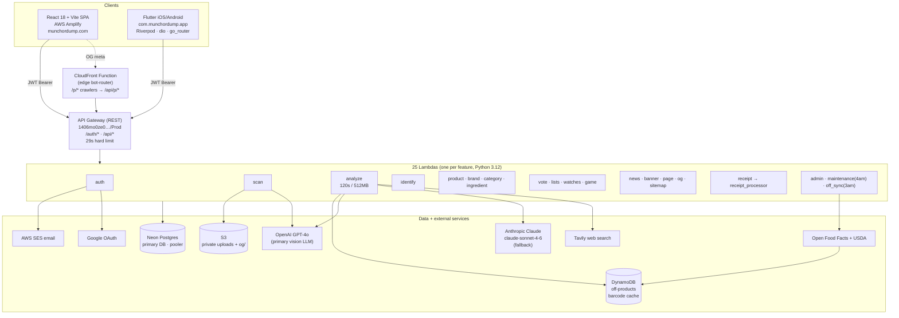

# Munch or Dump — Product, UX & Business Specification

*Comprehensive spec grounded in the live codebase (web SPA + Lambda/SAM API + Flutter iOS app). Catalog ~1,422 products (US/India/UK). Prepared for the iOS launch readiness review.*

> **How to read this:** Sections 1–7 are the full spec by dimension. Each ends with its own gaps/risks. **Appendix A** consolidates every launch risk in one prioritized place — start there if you only read one thing.

## Executive Summary

By this review, Munch or Dump is a **feature-complete and unusually polished product** for its stage: a working scan→verdict engine with a genuinely differentiated idea (the six-verdict model — especially **BULLSHIT** for marketing-vs-label hypocrisy and **ENGINEERED** for ultra-processing), a ~1,422-product catalog grown at near-zero marginal cost via formula-fingerprint caching, "For You" personalization, Compare, a game with a leaderboard, and a real Flutter iOS client with native camera, Keychain auth, and strong web parity.

**The risk is not the product — it's the launch surface.** Seven independent reviews converged on the same conclusion: the binary about to ship is missing a tier of things App Store review, first users, or the law will catch on day one. They cluster into four themes:

1. **The iOS app has no legal/compliance surface.** The satire/defamation shield, medical disclaimer, privacy policy, Terms-acceptance gate, in-app account deletion, and iOS privacy manifest that protect the *web* product **do not exist in the Flutter app** — which also collects sensitive health data (diabetes, pregnancy) with no consent screen. Simultaneously a likely App Store rejection (Guideline 5.1.1) and live legal exposure.

2. **A contract-drift bug: anonymous scanning is broken end-to-end.** When "login required to scan" was added, both `/api/scans` and `/api/analyze` began returning **401** for anonymous calls — but the Flutter app and its PLAN still assume barcode scanning works without an account. A first-time user who scans before signing in hits a hard error. Decide now: re-allow anonymous barcode-only analyze, **or** update the app to gate scanning and fix the copy.

3. **Monetization can't earn — and the copy contradicts it.** Stripe is installed but unwired, and **Apple requires StoreKit/IAP for digital goods** (Stripe-for-digital is rejected on iOS), which isn't present. Meanwhile the app/site still says "free, no paywall, you're not the product." Today there is no way to charge anyone, and the messaging conflicts with the planned paid tier.

4. **App Store mechanics aren't in place.** No Apple Developer team/signing (nothing reaches TestFlight), no **Sign in with Apple** (mandatory once Google login is offered → rejection), no analytics/crash reporting (launch is unmeasurable), and "Watch"/watchlist is sold but has **no push notifications** behind it.

Plus one quick correctness fix: the score is computed/stored on a **0–90** scale but displayed **`/100`**, so nothing can ever score 91–100.

The product is in good shape. Clear the P0 items in **Appendix A** before submitting, and the rest is sequencing.

## Contents
1. [Product Vision & Positioning](#product-vision-positioning)
2. [Feature Specification](#feature-specification)
3. [UX, Flows & Design System](#ux-flows-design-system)
4. [Technical Architecture & Data](#technical-architecture-data)
5. [Business Model, Monetization & Growth](#business-model-monetization-growth)
6. [Trust, Risk, Legal & Data Integrity](#trust-risk-legal-data-integrity)
7. [Go-To-Market, iOS Launch Readiness & Metrics](#go-to-market-ios-launch-readiness-metrics)
8. [Appendix A — Consolidated Launch-Readiness Gaps](#appendix-a)

---

# 1. Product Vision & Positioning

## Product Vision & Positioning

### The problem

Food packaging is engineered to sell, not to inform. As the app's own About page puts it: *"product packaging is designed to sell, not to inform. Marketing teams spend millions making products look healthy, natural, or premium."* The truth lives on the ingredient list — *"but it's small, dense, and deliberately hard to parse."* Words like "Natural," "Wholesome," and "Clean" are, per the Support/Our Story page, *"All marketing. None of it regulated."*

Three structural facts make this a real, recurring pain rather than a niche concern:

1. **The signal is hidden by design.** The ingredient panel is intentionally small and jargon-dense. Reading it well requires food-science literacy most shoppers don't have (what does "disodium inosinate" or "maltodextrin" actually do?).
2. **Marketing claims actively contradict the label.** The backend has a dedicated verdict — `BULLSHIT` — reserved *only* for when "marketing claims on the package directly contradict the ingredient list" ("All Natural" + artificial flavors; "Protein Snack" where syrups dominate). This is the deception thesis encoded directly into the product logic.
3. **The decision happens in seconds, in-aisle.** A shopper holding a box needs a verdict now, not a research project. The core promise is "from label to verdict in under 30 seconds" (HowItWorks).

### Core value proposition

> **Scan a product, get an honest verdict on whether it's worth eating — in seconds.**

The app "reads the label like a scientist and explains it like a friend" (About / Support, repeated verbatim across pages — this is the central brand line). Concretely, the value delivered per scan is:

- A single, decisive **verdict** (one of six) plus a **0–90 score** (note: the AI prompt and DB score on a 0–90 scale, while the UI currently renders it as `/100` — see Gaps).
- A **per-ingredient breakdown** naming each red flag ("Every red flag named by ingredient" — landing trust signal).
- **Healthier alternatives** and personalized **"For You"** notes keyed to the user's diet, goals, and medical conditions (`personalization.py` signal registry; `PERSONALIZATION_SYSTEM_PROMPT`).
- **Evidence, not a black box**: the label images, parsed ingredients, and reasoning are all shown ("We show evidence. No black boxes." — About principles).

The defensible engineering underneath is **Formula Fingerprinting**: analysis runs once per unique ingredient combination (`SHA256` of sorted canonical ingredient UUIDs), cached in the `formulas` table. Most scans are cache hits (<80 ms, $0 AI cost); only novel formulas hit GPT-4o (Claude fallback, Tavily web search). This is what makes "instant honest verdict" economically viable at scale and lets a ~1,422-product catalog (US/India/UK) grow via agent-seeding at near-zero per-product cost.

### The verdict mental model — and why six

The product's central UX innovation is collapsing a complex nutritional judgment into **one word**. The six verdicts (defined in `ai_service.py` `SYSTEM_PROMPT` and surfaced in HowItWorks) form a deliberate ladder that separates two independent axes most rating apps conflate: **ingredient quality** and **marketing honesty**.

| Verdict | Color | Meaning (per code) | Why it exists as a distinct tier |
|---|---|---|---|
| **MUNCH** | Emerald | "Clean ingredient list. Whole foods or minimally processed. Very few additives." | The green light. The aspirational top. |
| **OKAY** | Sky | "Mixed quality. Some additives but not heavily engineered." Explicitly a **last resort** — used only when signals are genuinely balanced. | A deliberately *rare* middle so verdicts stay opinionated, not wishy-washy. |
| **TREAT** | Amber | "Indulgent (sugar/fat heavy) but simple ingredients" (ice cream, basic cookies). | Separates *honest indulgence* from *deception* — a brownie isn't lying to you. Anti-judgment: "Eat what you want. Just know what it is." |
| **ENGINEERED** | Indigo | "Clearly built in a lab, not a kitchen" — flavor-enhancer stacks, hyper-palatable triad (sugar + refined oil + refined starch), stacked emulsifiers. "Not necessarily dangerous — designed by food scientists to maximize palatability, not nutrition." Score ~30. | The signature verdict. Names ultra-processing (NOVA 4) as its own category, distinct from "junk." Captures the "chemistry project" insight. |
| **DUMP** | Red | "Highly processed" — artificial colors, long lists (>18), modified starches, hydrogenated oils (hard rule). | The hard no. |
| **BULLSHIT** | Purple | "ONLY when marketing claims directly contradict the ingredient list." Reserved for hypocrisy, not for honest junk food. | The brand's reason for being: it punishes *lying*, not just bad ingredients. The most viral/satirical verdict. |

**Why six and not three (Yuka's red/orange/green) or A–E (Nutri-Score)?** Because the brand thesis is that a clean scale loses the two things that make food shopping infuriating: (a) the difference between *indulgent-but-honest* (TREAT) and *processed-and-pretending* (ENGINEERED/BULLSHIT), and (b) the specific crime of marketing that contradicts the label. The verdict words are themselves the product's voice — they editorialize where a number or grade stays neutral. The system prompt encodes hard rules and heuristics (NOVA, ingredient-count thresholds, sweetener-stacking, baby-food strictness, pet-food standards) so the verdicts are reproducible, not vibes — but the *output* is intentionally blunt.

### Target user personas

Drawn from what the app actually optimizes for (personalization signals, pet/baby-food rules, India/UK/US catalog, the satirical voice):

1. **The Skeptical Label-Reader ("I knew it").** 28–45, health-conscious, distrusts food marketing, already flips packages over in the aisle but can't decode the additives. Wants confirmation and ammunition. The core persona — the entire "you're being lied to" voice is written for them. *JTBD: "When I'm deciding between two products, help me catch the one that's lying so I can buy the honest one."*

2. **The Condition-Driven Shopper.** Has diabetes, hypertension, a kidney condition, or food allergies; or is pregnant / feeding a baby (the prompt has explicit `is_baby_food` strict-mode rules). Needs the *personalized* "For You" note that "always addresses the nutrient most relevant to" their condition (`PERSONALIZATION_SYSTEM_PROMPT`). *JTBD: "Tell me if THIS product is a problem for MY body, not the average body."*

3. **The Goal-Chaser (weight / muscle / "clean eating").** Onboarding captures `persona`, `goals`, `dietary`. Scans protein bars, "keto" snacks, granola — exactly the fake-healthy category the "multiple sweeteners" and "hyper-palatable triad" rules are tuned to catch. *JTBD: "Stop me from buying a 'protein snack' that's mostly syrup."*

4. **The Curious / Entertained Browser (top-of-funnel).** Pulled in by the satire — the "Can You Tell?" guessing game, the leaderboard, shareable verdict cards. Doesn't have a health mission yet; converts to scanning when they hit their own pantry. *JTBD: "Show me something funny and a little outrageous about the food I already eat."* This persona is the growth engine and the reason for the game/share surface.

### Jobs-to-be-done (consolidated)

- **In-aisle decision** (primary): "Should I put this in my cart?" → scan barcode/label → verdict in seconds.
- **Vindication / ammunition:** "Prove this 'healthy' product is junk." → BULLSHIT/ENGINEERED verdict + named red flags.
- **Personalized safety read:** "Is this OK for my diabetes / my baby / my allergy?" → For-You note.
- **Comparison:** "Which of these two is less bad?" → the premium Compare panel.
- **Browse & discover:** "What's the verdict on X?" → open search/browse over the ~1,422-product catalog (gated to a teaser when logged out).
- **Entertainment / sharing:** "Can you tell which one's the dump?" → game + leaderboard + share cards.

### Differentiation vs. the field

The benchmark is **Yuka** (~50M users): barcode scan → 0–100 score → green/orange/red, additive flags, "better product" swaps, crowd-built off Open Food Facts. Munch or Dump is best understood as **"Yuka with an opinion and a voice"** — it trades Yuka's clinical neutrality for an editorial, satirical point of view, and adds the two things Yuka structurally won't say.

| Dimension | Munch or Dump | Yuka (~50M) | Open Food Facts | Fooducate | Bobby Approved |
|---|---|---|---|---|---|
| **Output** | 6 opinionated word-verdicts + score + evidence | 0–100 score, 3 colors | Raw data + Nutri-Score/NOVA | Letter grade (A–D) + chatty tips | Binary "approved / not" vs. a banned-ingredient list |
| **Voice** | Satirical, blunt, anti-marketing — "DUMP means dump, no softening" | Clinical, neutral | None (database) | Friendly coach | Founder-driven, ingredient-purist |
| **Names the lie** | **Yes — `BULLSHIT` verdict** for claim-vs-label contradiction | No (scores nutrition, not honesty) | No | No | Implicitly (banned-list) |
| **Names ultra-processing as its own thing** | **Yes — `ENGINEERED`** (NOVA-4, hyper-palatable triad) | Partially (additive penalties) | NOVA field exists, not editorialized | Limited | No |
| **AI vision / no-barcode scan** | **Yes** — photo of any label or receipt, GPT-4o OCR | Mostly barcode-dependent | Barcode | Barcode | Barcode |
| **Personalization to medical conditions** | **Yes** — For-You notes keyed to diet/goals/conditions | Limited (diet prefs) | No | Some (allergens, goals) | No |
| **Cost model / scale** | Formula-fingerprint cache = $0 marginal per scan | Crowd DB | Crowd DB | Proprietary | Proprietary list |
| **Catalog depth** | ~1,422 curated (US/India/UK), AI-seeded; agent-grown | Millions (huge edge) | ~3M+ (huge edge) | Large | Large |
| **Geographic reach** | US + **India** + UK (India is a real differentiator) | EU/US-heavy | Global | US-centric | US-centric |

**Where we're better:** (1) we say the quiet parts — the lie (BULLSHIT) and the lab-engineering (ENGINEERED) — that a neutral score can't; (2) AI vision means you can scan *anything* with a label, not just things with a recognized barcode in a database; (3) condition-level personalization; (4) the voice itself is a moat and a growth loop (shareable, funny, screenshot-worthy) that a clinical app can't replicate; (5) genuine India coverage.

**Where we're worse (honestly):** (1) **catalog size** — ~1,422 products vs. Yuka/OFF's millions is a 1000×+ gap; a cold-barcode scan of an obscure product is far likelier to miss; (2) **trust/credibility** — Yuka cites scientific sources and has scale-driven legitimacy; our verdicts are explicitly framed as "satire and entertainment… not a factual assessment," which is a legal shield but also caps perceived authority; (3) **brand recognition and install base** — we are pre-launch vs. 50M users; (4) the opinionated voice that wins some users will alienate the ones who want sober data.

### Brand personality & voice

**Personality:** the brutally honest food-scientist friend. Smart, unsponsored, a little savage, never preachy. Anti-marketing, pro-truth, anti-judgment about *enjoyment* (you can eat junk — just know it's junk).

**Codified voice rules** (from the system prompt and content pages):
- *"Truth over marketing."* / *"You're not the product."* (Support: "Free to use… and you're not the product.")
- *"Reads the label like a scientist and explains it like a friend."* (the canonical line)
- *"If a product is good, we say so. If it's garbage with good marketing, we say that too. The truth doesn't need a filter."* (About)
- The model is instructed: *"Write like a person, not a report. Short sentences… If something is bad, say it's bad — don't soften it."*
- Independence as identity: *"No brand deals. Ever."* / *"Independent — no investors, no ads"* / *"nobody can buy a better one."* (Support)
- Self-aware satire as the legal/tonal frame: *"one automated opinion, generated in seconds, with all the confidence and none of the accountability of a real person. Take it as a vibe, not a verdict you would stake your health on."* (HowItWorks). The disclaimers ("satire and entertainment," "not claims of fact") double as a defamation shield.
- Seasonal, playful hero copy ("Love is blind. Your ingredient list isn't.", "Your food has a PR team. You don't.") keeps the top-of-funnel voice consistent and shareable.

### Positioning statement

> **For** health-conscious shoppers who are tired of being misled by food marketing,
> **Munch or Dump** is an AI ingredient-analysis app that scans any product — by barcode, label photo, or receipt — and returns one honest, blunt verdict (MUNCH, OKAY, TREAT, ENGINEERED, DUMP, or BULLSHIT) with the evidence behind it.
> **Unlike** Yuka and other clinical scoring apps, it tells you not just *how processed* a product is but *whether it's lying to you* — in a voice that reads the label like a scientist and explains it like a friend, with no brand deals, ever.

One-liner: **"Truth over marketing. Scan it, and we'll tell you straight."**

### Gaps & launch risks

Prioritized for an iOS launch, highest-risk first:

1. **Catalog depth is the existential gap (P0).** ~1,422 products vs. Yuka/OFF's millions. iOS reviewers and first users *will* scan random pantry items; a high cold-scan miss rate (no cached formula, possible OCR/analysis failure) directly undercuts the "scan anything, instant verdict" promise. The formula-fingerprint cache only helps on *repeat* formulas — a launch surge of novel scans means real GPT-4o cost and latency, exactly when reliability matters most. Mitigation: aggressive pre-seeding of US-market top-sellers; graceful "we'll analyze this now" UX for misses.

2. **Score scale inconsistency: 0–90 vs. /100 (P1).** The AI prompt and ENGINEERED guidance score on **0–90** (e.g. "Score ~30"), but the UI/hero renders scores as **`/100`**. A score that maxes at 90 but is displayed out of 100 means no product can ever show 91–100 — observant users (and App Store reviewers) will notice the ceiling. Reconcile the scale before launch.

3. **Authority vs. satire tension (P1).** The legal framing ("satire and entertainment," "not a factual assessment") is a smart defamation shield, but it actively undermines the trust a health-decision tool needs — and contradicts personas 2 and 3 (condition-driven users making real dietary calls). Yuka's edge is *credibility*. Risk: users either over-trust a disclaimed "satire" verdict (safety/liability) or dismiss it as a joke (no value). The product needs a clearer line between "blunt opinion" and "don't make medical decisions on this."

4. **Positioning collateral is web-only and partly inconsistent with the workspace's stated monetization (P2).** The Support page asserts *"Free to use… No paywall"* and *"you're not the product,"* but the documented direction is a freemium model with scan caps (free 100 / premium 1,000) and a Stripe premium tier. At iOS launch the in-app copy must match the actual gating, or App Store reviewers flag the mismatch and users feel bait-and-switched. The "no paywall" promise needs softening to "core scanning is free" before paid tiers ship.

5. **Login-to-scan friction at the top of the funnel (P2).** Scanning requires login (server-enforced). For a curiosity-driven iOS install, forcing auth *before the first verdict* (the app's only "magic moment") risks high first-session drop-off. Consider one free anonymous scan before the gate. (Apple Sign-In is also effectively mandatory for App Store approval once Google Sign-In is offered — already flagged as blocked-on-user.)

6. **Verdict subjectivity / brand-defamation exposure at scale (P2).** `BULLSHIT` and `DUMP` are, by design, opinionated claims about named, trademarked products. The disclaimers mitigate this, but a satirical verdict on a litigious brand is a real launch-day risk. The "found something wrong → contact page, we'll review or remove" loop must be fast and visible.

7. **Differentiation must be legible in the first 10 seconds (P3).** The app's edge over Yuka (the lie-detection of BULLSHIT, the lab-detection of ENGINEERED) is subtle and lives inside individual verdicts. App Store screenshots and onboarding need to *lead* with these two verdicts, or the app reads as "another Yuka clone with a smaller database" — which, on catalog size alone, is a losing comparison.

---

# 2. Feature Specification

## Feature Specification

> Grounded in the three repos under `/Users/shekhar/custom_softwares/munchordump`: `munch-or-dump-api` (Lambda/SAM backend), `munch-or-dump-ui` (React web), `munch-or-dump-app` (Flutter — the iOS launch target). Endpoints cited are the real handlers in `munch-or-dump-api/functions/*`; screens are the real components in `munch-or-dump-ui/src/pages/*` and `munch-or-dump-app/lib/features/*`.

### 1. The two-step scan pipeline (core engine)

The product is fundamentally a **scan → verdict** machine, and the scan is deliberately split into two endpoints so the expensive AI work runs at most once per unique formula.

**Step 1 — OCR ingest: `POST /api/scans`** (`functions/scan/handler.py`)
- Accepts either pre-extracted `ingredient_text` (cheap regex split, `_split_ingredient_text`) **or** `file_urls` already uploaded to S3 (vision OCR via GPT-4o, `_extract_from_images`). Plain text path is ~50–150 ms; the vision path is a paid LLM call.
- Vision OCR extracts not just ingredients but also **barcode** (validated `^\d{8,14}$`), **serving size**, and **country of origin** in one shot (`_EXTRACTION_SCHEMA`).
- **Security-hardened**: scanning requires login (`401 "Sign in to scan a product."`); `filter_managed_urls` rejects any URL not from our own authenticated S3 upload flow (blocks SSRF / unauthenticated-vision abuse); banned users blocked; per-plan scan cap enforced here (free = 100, premium = 1,000); the vision path also burns the shared per-day AI quota via `check_analyze_limit`.
- Stores a draft `scans` row (id, user, image_url, extracted_text JSON, ip) and returns `{ scan_id, ingredients, barcode, serving_size, country_of_origin }`.

**Step 2 — Fingerprint + verdict: `POST /api/analyze`** (`functions/analyze/handler.py`)
1. `normalize_and_resolve` maps each raw OCR name → canonical ingredient UUID via `ingredient_aliases` (case-insensitive), else slug lookup, else creates a new `ingredients` row.
2. `compute_formula_hash` = `SHA256("|".join(sorted(UUIDs)))` (`shared/formula.py`).
3. **Formula cache lookup** in `formulas`:
   - **Hit** → return cached verdict/score/`ai_analysis` (target <80 ms, zero AI cost), bump `scan_count`. (Caveat: `gpt-4o-mini`-analyzed formulas and admin `force_reanalysis` are treated as misses to upgrade quality.)
   - **Miss** → run the full LLM analysis, `upsert_formula`, write back ingredient safety ratings.
4. Upsert `brands` → `products` (carrying `formula_id`, dietary flags, NOVA, barcode, serving size, origin) → `product_ingredients`.
5. Patch the `scans` row with `product_id`, `verdict`, `score`, `ai_summary`.

**Barcode-first resolution chain** (when no ingredient text): local `products` table → OFF DynamoDB `off-products` (with UPC/EAN normalization, `_get_off_data`) → **Tavily web search** (`_tavily_barcode_search`, Claude extracts from results, 10 s daemon-thread cap, forces `confidence=LOW` and a `NEEDS_REVIEW` flag). A photo-scan with no printed ingredient list also falls back to `_tavily_name_search` (8 s cap). Web-sourced ingredients are surfaced to the user with an amber "Needs review · sourced from web search" banner (`Result.jsx` line 189).

**Maturity: Shipped** on all three clients. The Flutter client (`munch_api.dart` `analyze()` / `createScan()` / `createUploadUrl()` / `uploadImage()`) and `scan_screen.dart` implement live barcode camera (`mobile_scanner`), manual barcode entry (works in simulator), and auth-gated label-photo scan — all converging on `/api/analyze`.

### 2. Verdict + 0–90 score + NOVA

- **Six verdicts**: `MUNCH` (90), `OKAY` (60), `TREAT` (45), `ENGINEERED` (30), `DUMP` (20), `BULLSHIT` (0) — the canonical `_VERDICT_SCORE` map. Score is verdict-derived (the LLM's per-ingredient `impact_score` sums are explanatory, not the source of the headline number).
- The verdict is produced by a heavily rule-laden system prompt (`shared/ai_service.py SYSTEM_PROMPT`) covering ingredient-count heuristics, hyper-palatable triad, flavor-enhancer stacks, hard rules (hydrogenated oils → DUMP), baby-food strictness, pet-food rules, and a "rare OKAY" rule.
- **Deterministic post-processing** (`_apply_snack_rules`) runs after the LLM on every cache *miss* and can floor the verdict regardless of the model: hyper-palatable triad → ENGINEERED, 2+ sweeteners → OKAY floor, flavor+texture stack → OKAY, MSG+nucleotide+maltodextrin → ENGINEERED, NOVA 4 → TREAT/ENGINEERED floor, stacked phosphate salts → TREAT, serving-size manipulation → OKAY floor, plus "clean short list protection" (≤6 clean ingredients can't be ENGINEERED/DUMP) and polarity hygiene (strips positive reasons from negative verdicts; forces avoidance language into `consumption_context`).
- **NOVA group (1–4)** is produced by the LLM but **OFF's NOVA value takes precedence** when present (authoritative). NOVA is consistency-checked against the verdict ("NOVA 4 cannot be MUNCH/OKAY").
- `ENGINEERED` gets a bespoke "Food Engineering Detected" report card on the web Result page (`Result.jsx` line 290); `MUNCH` fires confetti (reduced-motion aware).
- **Resilience**: GPT-4o is primary; on failure it falls back to **Claude Sonnet** (`invoke_claude`), then to an **OFF NOVA-derived verdict** if even that fails. All LLM output passes through `shared/coerce.py`, which guarantees valid enums and never returns a 500 for a malformed response.

**Maturity: Shipped.**

### 3. Per-ingredient safety breakdown

Each analysis returns `ingredients_detected[]` with `name`, `safety_rating` (`safe`/`moderate`/`concerning`/`harmful`), `explanation`, and a signed `impact_score` (−30…+30). Ratings are written back to the `ingredients` table so the catalog enriches over time. Rendered as `WhatWeFound` + the expandable `IngredientBreakdown` (web) and `_IngredientBreakdown` with a concern legend and `ImpactScore` chips (mobile `result_screen.dart`). Ingredient pages (`/ingredients/:slug`, `GET /api/ingredients/:slug`) exist as their own browseable surface.

**Maturity: Shipped.**

### 4. "For You" personalization (diet / goals / medical conditions)

- A signal registry (`shared/personalization.py`) maps ~25 keys across four sources — **conditions** (diabetes, hypertension, celiac, nut allergy, pregnancy, kidney disease, high cholesterol, IBS), **dietary** (keto, vegan, gluten-free, dairy-free, low-sodium, low-sugar, halal, kosher, vegetarian), **goals** (weight loss, high protein, clean eating, managing condition), and **persona** (parent) — each with a clinical priority and a context string injected into the prompt.
- Notes are cached per **profile fingerprint** (`SHA256` of active signal keys + free-text `context`) inside `formulas.profile_notes`, so two users with identical profiles share one cached note. On miss, a `gpt-4o-mini` call (`invoke_llm_focused` + `PERSONALIZATION_SYSTEM_PROMPT`) generates a ≤40-word note (~150–300 ms) and stores it.
- An **instant deterministic fallback** (`_compute_profile_note`) renders before/instead of the AI note for every registered signal, so the user never waits.
- Profile is captured via an onboarding flow (web `OnboardingModal`; mobile `onboarding_screen.dart` + `personalization_options.dart`, saved via `PATCH /auth/profile`). On mobile the "For You" card is a **dark gated card** (`_ForYouCard`) — locked for logged-out users.

**Maturity: Shipped.**

### 5. Healthier alternatives

Generated **at product-read time**, not at analyze time: `GET /api/products/:slug` (`product/handler.py` ~L420) returns `better_alternatives[]` for any non-MUNCH verdict. Logic: strict `subcategory` match → same `_subcategory_group` fallback, ranked MUNCH-first then by score, carrying forward the current product's *true* dietary constraints (a vegan product only suggests vegan alts), each with a `score_delta`. Rendered as `BetterAlternatives` (web Result/Product) and `_AlternativeRow` (mobile). Quality of suggestions scales with catalog density per subcategory.

**Maturity: Shipped.**

### 6. Marketing-claim call-outs + the BULLSHIT detector

- `marketing_claims[]` = `{ claim, reality, is_misleading }`, plus a 0–10 `health_wash_score`. The `BULLSHIT` verdict is reserved (by prompt rule) for when package claims directly contradict the ingredient list ("All Natural" + artificial flavors). Plain junk food with no health claims gets `DUMP`, not `BULLSHIT`.
- Rendered as `MarketingVsReality` (web, in the expandable section) and `_ClaimCard` (mobile).

**Maturity: Shipped.**

### 7. Receipt / cart "Cart Intelligence"

- **Async two-phase**: `POST /api/receipt` creates a `receipt_jobs` row, fires `receipt_processor` Lambda asynchronously, returns `{ job_id }` in <1 s; client polls `GET /api/receipt/{job_id}` every 2 s for `{ status, items, total, is_premium, free_limit }`.
- The processor OCRs the receipt → for each line item resolves via DB → OFF → web search → LLM, and **persists discovered products back into `products`/`formulas`** (flagged `quality_flag='receipt'` so they stay out of the public library until a real scan promotes them — zero future AI cost).
- **Freemium gate**: free tier analyzes only the first `FREE_LIMIT = 3` items; the rest return `locked: true` ("Free scans analyze the first 3"). Premium unlocks all.
- Web has a full **CartContext** (`munch_cart_v1` localStorage) — scanned/receipt items collect into a cart, surfaced as a "Compare" panel; the Result page has an "Add to cart" toggle.

**Maturity: Shipped (mobile `receipt_screen.dart` polls + renders locked items). The richer cart aggregation/summary lives mainly on web; mobile receipt is a per-item verdict list.**

### 8. Compare

Side-by-side product comparison. Web `Compare.jsx` (a premium-styled panel, fed by the cart). Mobile `compare_screen.dart` lets the user pick two products (each slot fetches `GET /api/products/:slug`) and shows verdicts/scores/tags side by side with `VerdictBadge`.

**Maturity: Shipped (basic 2-up compare on mobile; richer multi-item compare on web). No server "winner" computation — it's client-side presentation.**

### 9. The game + leaderboard ("Can You Tell?")

- `GET /api/game/lineup` returns one round: a target product + 4 shuffled ingredient lists (one correct), excluding receipt/`NEEDS_REVIEW`/hidden products and requiring ≥3 ingredients. The UI (`Game.jsx`, mobile `game_screen.dart`) is a guess-the-ingredient-list challenge with a streak + speed scoring model.
- `POST /api/game/score` records the run under a **server-assigned funny name** (`_funny_name` = adjective × noun, e.g. "Suspicious Crouton") — real players never type a name; `GET /api/game/leaderboard` returns top 10. Score capped at 100,000 against tampering.

**Maturity: Shipped.**

### 10. Watchlist / alerts

- `user_watches` (product *or* brand, XOR-constrained). `GET/POST/DELETE /api/watches`. When a new formula is analyzed, `_notify_watchers` emails product- and brand-watchers via SES; a confirmed **formula change** fires `_notify_formula_change` with a before/after verdict diff.
- Web `WatchlistPage.jsx`; mobile `watchlist_screen.dart` + `addWatch/removeWatch`.

**Maturity: Shipped.**

### 11. Community votes

- `votes` table (munch/dump). `POST /api/votes` (auth-gated on mobile), `GET /api/votes?summary=1` returns a split score. Shown as `CommunityVoting` (web) and `ResultActions` (mobile) alongside the AI verdict.

**Maturity: Shipped.**

### 12. Saved lists

`user_saved_products` (named lists: saved/approved/avoid/custom). `GET/POST/DELETE /api/lists`. Mobile `ResultActions` save toggle derives state from the user's library so it never shows a stale "Save".

**Maturity: Shipped.**

### 13. Search / browse (with freemium teaser gate)

- Open to everyone but **gated to a teaser** when logged out, server-enforced via `gated: true` + hard caps: products `ANON_LIST_LIMIT = 5`, brands `ANON_BRAND_LIST_LIMIT = 5` / `ANON_BRAND_PRODUCT_LIMIT = 4`, categories `ANON_LIMIT = 10` / `ANON_PRODUCT_LIMIT = 6`.
- Surfaces: Search (`/api/products`), Brands + brand pages (`/api/brands`), Categories + category pages (a 33-ish-entry taxonomy leaderboard, `/api/categories`), Ingredient pages. Individual product pages (`/p/:slug`) are always fully open for SEO and are server-rendered (`page`/`og` handlers + sitemap + CloudFront bot-router). Country-of-origin flags render on verdict cards.
- Mobile: `search_screen.dart` shows a "Sign in to see all results" card when `gated && total > items.length`; full browse stack (`brands/categories/ingredient` screens) is wired.

**Maturity: Shipped.**

### 14. Identify (product-from-image)

`POST /api/identify` — a curated vision endpoint (the raw LLM is never exposed) returning HIGH/MEDIUM/LOW match candidates from a label photo, used by the web `IdentificationEngine`. Counts against the AI quota.

**Maturity: Shipped (web). Not a distinct mobile screen — mobile folds identification into the scan flow.**

### 15. News

Admin-authored posts: `GET /api/news`, `/api/news/:slug`; admin CRUD. Web `News.jsx`/`NewsPost.jsx`; mobile `news_screen.dart` + `getNews`/`getNewsPost`.

**Maturity: Shipped.**

### 16. Disclaimers / legal (defamation shield)

A dedicated `Legal.jsx` page frames **every verdict as AI-generated satire and subjective opinion, not fact** — "Labels like DUMP, ENGINEERED, or BULLSHIT are opinions," "AI-generated content may contain errors," not medical advice, plus an explicit acknowledgement clause. A **contact form** (`POST /api/contact` → SES to owner, owner address resolved server-side and never exposed, per-IP rate-limited, length-capped + HTML-escaped) replaces any public email. About/HowItWorks/Privacy/Support round out the static content.

**Maturity: Shipped.**

### Feature-maturity matrix

| Feature | Endpoint(s) | Web | iOS (Flutter) | Maturity |
|---|---|---|---|---|
| Two-step scan (OCR→fingerprint) | `/api/scans`, `/api/analyze` | ✅ | ✅ camera+manual+photo | **Shipped** |
| Verdict + 0–90 score + NOVA | `/api/analyze` | ✅ | ✅ | **Shipped** |
| Per-ingredient safety + impact | `/api/analyze` | ✅ | ✅ | **Shipped** |
| "For You" personalization | `/api/analyze`, `/auth/profile` | ✅ | ✅ (gated card) | **Shipped** |
| Healthier alternatives | `/api/products/:slug` | ✅ | ✅ | **Shipped** |
| Marketing claims / BULLSHIT / health-wash | `/api/analyze` | ✅ | ✅ | **Shipped** |
| Receipt "Cart Intelligence" (3-free gate) | `/api/receipt`, poll | ✅ (+cart) | ✅ (per-item list) | **Shipped / partial cart on mobile** |
| Compare | `/api/products/:slug` | ✅ | ✅ (2-up) | **Shipped (presentation-only)** |
| Game + funny-name leaderboard | `/api/game/*` | ✅ | ✅ | **Shipped** |
| Watchlist + email alerts | `/api/watches` | ✅ | ✅ | **Shipped** |
| Community votes | `/api/votes` | ✅ | ✅ | **Shipped** |
| Saved lists | `/api/lists` | ✅ | ✅ | **Shipped** |
| Search/browse (teaser gate) | `/api/products`, `/brands`, `/categories`, `/ingredients` | ✅ | ✅ | **Shipped** |
| Identify-from-image | `/api/identify` | ✅ | folded into scan | **Shipped (web)** |
| News | `/api/news` | ✅ | ✅ | **Shipped** |
| Disclaimers + contact form | `/api/contact` | ✅ | partial | **Shipped (web)** |
| Premium tier / payments | — | ❌ no checkout | ❌ no checkout | **Planned** |
| Google sign-in (iOS) | `/auth/google` | ✅ | wired, **blocked on iOS client ID** | **Partial** |

### Gaps & launch risks

Prioritized for an iOS launch:

1. **Monetization is not closeable (P0 for a "premium" launch).** The freemium *gates* are real and server-enforced (scan caps 100/1,000, receipt 3-free, browse teasers), but there is **no payment path**: no Stripe/IAP integration anywhere in `munch_api.dart` or the API (`plan` is only ever read, never written via a purchase flow; the only "stripe" strings in the UI are CSS accent colors in `Examples.jsx`). A user who hits a gate has no in-app way to upgrade. For iOS this is also an **App Store compliance risk** — paid tiers must use StoreKit/IAP, not Stripe, so the web Stripe plan can't be reused on iOS.
2. **Google sign-in is blocked on iOS (P0).** `google_sign_in` is in `pubspec.yaml` and `google_auth_service.dart`/`/auth/google` are wired, but per MEMORY this is blocked on an iOS OAuth client ID. Email/password works, but launching without "Sign in with Google" hurts conversion on the very flow (scanning) that requires an account.
3. **Login-walled core action (P1 UX risk).** Scanning — the app's entire reason to exist — returns `401` for anonymous users at *both* `/api/scans` and `/api/analyze`. First-run users must register before they can get a single verdict. No "try one free scan" path exists. This is a defensible cost decision but a real first-impression funnel risk for a cold app-store install.
4. **Receipt "Cart Intelligence" is thinner on mobile (P1).** The aggregated cart, multi-item Compare, and cart history (`CartContext`, `munch_cart_v1`) are a web-first experience; mobile receipt is a flat per-item verdict list with a locked-items gate. The "intelligence" framing oversells what iOS currently shows.
5. **Rate limiter fails open (P1 cost risk).** `shared/rate_limit.py` allows requests on any DB error (intentional for availability). Combined with vision OCR and Tavily+Claude fallbacks per miss, a DB hiccup or determined abuser could run up real AI spend. Worth a hard ceiling before a public launch.
6. **Web-sourced verdicts can be wrong (P2 trust/legal risk).** Tavily-derived ingredient lists are forced to `LOW` confidence and flagged `NEEDS_REVIEW`, but they still produce a public-looking verdict. For a brand built on "truth over marketing," a confidently-wrong verdict on a misidentified barcode is the worst-case content risk; the satire disclaimer mitigates legally but not reputationally.
7. **Alternatives quality is catalog-density-dependent (P2).** `better_alternatives` only returns good suggestions where a subcategory is densely populated. Thin subcategories (newer regions, niche `product_type`s) will show few or no alternatives — a visibly empty section on a `DUMP` result.
8. **No offline / poor-connectivity handling surfaced (P2 mobile-specific).** Every verdict requires a round-trip (the formula cache lives server-side); there's no evidence of client-side caching of recent results beyond React Query/web. On mobile, a flaky connection mid-scan degrades the headline experience.
9. **Identify-from-image not exposed as a distinct mobile affordance (P3).** Works on web; on iOS a user who photographs a *front* package (no ingredient list) relies on the name/Tavily fallback rather than an explicit "identify this product" path.

---

# 3. UX, Flows & Design System

## UX, User Flows & Design System

The iOS launch target is the **Flutter app** in `munch-or-dump-app/` (Dart 3.12, `flutter_riverpod` + `go_router`, deps: `mobile_scanner`, `image_picker`, `google_sign_in`, `dio`, `flutter_secure_storage`). It is a faithful re-skin of the React web app (`munch-or-dump-ui/`) onto native, deliberately mirroring the website's "editorial / lab-paper" identity. The two clients share verdict semantics, color hexes, and the same backend (`AppConfig.apiBaseUrl` → the production API Gateway URL), so this section maps the Flutter UX and flags where it diverges from the web for an App Store review.

### Screen inventory

Routing is a single flat `GoRouter` (`lib/core/router/app_router.dart`) with 22 named routes — **no bottom tab bar, no drawer**; everything is reached by `pushNamed`/`goNamed` off the home screen and contextual buttons (confirmed: no `BottomNavigationBar`/`NavigationBar`/`TabBar`/`Drawer` anywhere in `lib/`).

| Screen (file) | Route | Auth | Purpose / notable UX |
|---|---|---|---|
| Home (`home/home_screen.dart`) | `/` | open | Landing: graph-paper hero, wordmark + `BETA` badge, two-tone headline, tap-to-search field, black "Analyze a product" CTA, three trust taglines, live "Recently analyzed" feed (`searchProducts(limit:6)`), browse chip row, account avatar |
| Scan (`scan/scan_screen.dart`) | `/scan` | open (barcode) / gated (photo) | Live `MobileScanner` camera with a framing reticle + manual barcode `TextField` + "Scan a label photo" + "Scan a receipt"; full-screen `AnalysisLoader` overlay |
| Result (`result/result_screen.dart`) | `/result` | open | The headline screen: verdict hero, NOVA + dietary pills, gated "For You" card, "Why" bullets, impact-scored ingredient breakdown, marketing-claim cards, bottom line, alternatives, `ResultActions` (save/watch/vote) |
| Product (`product/product_screen.dart`) | `/product/:slug` | open | Catalog detail by slug; **reuses `ResultScreen`** (same verdict shape) |
| Search (`browse/search_screen.dart`) | `/search` | open (teaser) | Query field + horizontally-scrolling verdict & dietary `FilterChip`s; doubles as the compare picker via `onPick` |
| Categories / Category (`browse/categories_screen.dart`) | `/categories`, `/category/:slug` | open | Leaderboard list with `AVG <score>` per category → product list |
| Brands / Brand (`browse/brands_screen.dart`) | `/brands`, `/brand/:slug` | open | Same `BrowseHubRow` pattern with avg score → brand product list |
| Ingredient (`browse/ingredient_screen.dart`) | `/ingredient/:slug` | open | Safety badge, E-number/additive chips, health effects, "avoid if", "found in" products |
| Compare (`compare/compare_screen.dart`) | `/compare?a=` | open | Two product slots side-by-side; higher score gets a green "Better pick" border |
| Game (`game/game_screen.dart`) | `/game` | open | "Guess the ingredients" — lineup → guess → reveal → game-over with funny-name leaderboard |
| Receipt (`receipt/receipt_screen.dart`) | `/receipt` | gated | Pick receipt photo → async job + 2s poll (≤45 tries) → per-item verdict list with locked rows |
| News / NewsPost (`news/news_screen.dart`) | `/news`, `/news/:slug` | open | List → `SelectableText` article body |
| Account (`account/account_screen.dart`) | `/account` | gated | Avatar, plan/tier chips, profile summary, links to history/watchlist, edit personalization, sign out |
| History (`history/history_screen.dart`) | `/history` | gated | `GET /api/scans` list with pull-to-refresh |
| Watchlist (`watchlist/watchlist_screen.dart`) | `/watchlist` | gated | "Saved & watching" — saved products, watched products, watched brands, each with remove action |
| Onboarding (`onboarding/onboarding_screen.dart`) | `/onboarding` | gated | Persona / goals / dietary / conditions chips + 150-char free-text; doubles as edit-profile |
| Auth (`auth/auth_screen.dart`) | `/login` | open | Email/password sign-in + register toggle; Google button shown only if `googleSignInEnabled` |
| Verify (`auth/verify_email_screen.dart`) | `/verify` | open | 6-digit email code entry + resend |
| Forgot (`auth/forgot_password_screen.dart`) | `/forgot` | open | Password reset request |

**Gating model.** The router (`_gatedRoutes`) hard-gates `/account`, `/onboarding`, `/history`, `/watchlist` — a logged-out user is bounced to `/` (anonymous-friendly: no login wall, the account icon is the deliberate entry point). Beyond routing, gating is feature-level: photo scan and receipt scan check `authControllerProvider` and show an inline "Sign in to…" message; save/watch/vote prompt sign-in via snackbar; search/brands/categories return a soft `gated` flag, surfacing a "Sign in to see all results — N products match" lock row (`search_screen.dart`); receipt results lock items past `freeLimit` (default 3) for non-premium.

### Journey map

**First run → personalization.** App opens directly on Home (`initialLocation: '/'`) — no forced onboarding wall (good for App Store first-impression; users can browse immediately). Onboarding is reached two ways: (1) after sign-in, `goAfterAuth` (`auth/auth_navigation.dart`) routes to `/onboarding` only if `user.needsOnboarding`, else Home; (2) imperatively from the Result screen's gated "For You" card ("Set up your profile") or Account's "Edit personalization". Onboarding captures `persona` (single: just me / parent / coach), `goals`, `dietary` (10 options incl. halal/kosher/keto), `conditions` (7, incl. pregnancy/diabetes/celiac), and a 150-char note — values are hard-pinned to the backend's allowed sets (`personalization_options.dart` comment: "MUST match `functions/auth/handler.py`").

**Core scan → verdict.** Three converging input paths (`scan_service.dart`):
- **Barcode** — live camera (`DetectionSpeed.noDuplicates`) or manual entry → `POST /api/analyze` directly. Anonymous-friendly fast path; the camera is paused on background/result to free the sensor (`didChangeAppLifecycleState`).
- **Label photo** (auth) — `image_picker` gallery → presigned S3 upload (`uploadImageFile`) → `POST /api/scans` (OCR draft) → `POST /api/analyze`.
- **Receipt** (auth) — its own async job + polling screen.

All converge on `AnalyzeOutcome` (`AnalyzeSuccess` / `AnalyzeNotFound` / `AnalyzeUnsupported`) and push Result. During the wait, a full-screen `AnalysisLoader` cycles the verdict word (MUNCH→…→BULLSHIT, 600ms) over five step labels ("Reading ingredients" → "Forming verdict", 3.2s each). Result shows `⚡ Instant verdict` (cache hit) vs `✨ Fresh analysis` — surfacing the formula-fingerprinting cache to the user.

**Browse/search → product → compare.** Home browse chips → Categories/Brands leaderboards → product (`ResultScreen`). Search filters by verdict + diet with a sequence-token guard against out-of-order responses. Compare launches the Search screen as a modal picker (`onPick`) for each slot.

**Account loop.** Result → Save/Watch (optimistic toggle reconciled against `libraryProvider`) → Watchlist; Scan → History. Sign-out flips session state and the router redirect silently moves the now-gated screen home (no manual nav).

### Design system (as actually implemented)

Centralized in `lib/core/theme/`. Material 3, **light theme only** (`themeMode: ThemeMode.light`; a `dark` theme exists but is explicitly "kept minimal — the redesign targets the light experience").

- **Palette** (`app_colors.dart`) — warm-paper "stone" scheme matching tailwind/web exactly: canvas `#F8F7F4` cream, white card surfaces, `inkPrimary` `#1C1917` (stone-900), `inkSecondary` `#78716C` (stone-500), `hairline` `#E7E5E4` borders. Emerald `#0E9F6E` is the single accent (used sparingly); the primary CTA is **pure black** `#0C0A09` (`BlackCtaButton`), not emerald. Ingredient severity is a four-tier ramp: red `#EF4444` (harmful) → orange (concerning) → amber (moderate) → emerald (safe).
- **Verdict color coding** (`verdict_palette.dart`) — each of the 6 verdicts carries a 6-role `VerdictTone` (deep word color, bar, mid, pale tint, border, dot) with exact web hexes, registered as a `ThemeExtension` (`context.verdicts.colorFor(verdict)`). Verdicts also carry emoji (`verdict.dart`): 🥑 MUNCH, 👍 OKAY, 🍩 TREAT, ⚙️ ENGINEERED, 🚮 DUMP, 🤡 BULLSHIT. `fromApi` tolerantly maps the legacy `ULTRA*` token → ENGINEERED.
- **Typography** — `google_fonts` **Inter** throughout; tight tracking on display/headline (w800/w900, negative letter-spacing). The verdict word renders at 72pt w900 in the Result hero. Note: Inter is fetched at runtime by `google_fonts` (network dependency unless bundled).
- **Component language** (`editorial.dart`) — bespoke "editorial" widgets ported from the site: `GraphPaperPainter`/`GridBackground` (60px grid @ 2.2% black, fading toward the bottom), `Eyebrow` (ultra-letter-spaced uppercase labels), `TwoToneHeadline`, `BlackCtaButton` (animated press + sliding arrow), `WebVerdictBadge`, `AccentTopBorderCard` (colored top stripe = the web product card), `MetaPill`, `ImpactScore` (tabular `+10`/`−8`), `SectionLabel`. Standard Material primitives (`FilledButton`, `OutlinedButton`, `ChoiceChip`/`FilterChip`, `Card`, `ListTile`, `SnackBar`) are themed centrally in `app_theme.dart` (16px radii, hairline borders, floating snackbars). This is the native analog of the web's shadcn/ui set — purpose-built, not a port of the React components.
- **Motion** — Flutter implicit/explicit animations rather than framer-motion: `AnimatedContainer` (CTA press), `AnimatedRotation` + `AnimatedSize` (ingredient row expand), `AnimatedSwitcher` + `SlideTransition` (the rolling verdict-word loaders). Restrained and consistent with the calm brand.
- **"For You" treatment** — the personalization card is the one dark, dramatic surface: amber-on-near-black gradient with glow shadows. Locked state blurs placeholder copy behind a lock glyph (`ImageFilter.blur`) with "Sign in to unlock" / "Set up your profile" CTAs — a clean upsell pattern.

### iOS / mobile-specific UX

- **Camera/scan ergonomics** — real native camera via `mobile_scanner` with a 230×130 framing reticle, lifecycle-aware start/stop, and a graceful `_CameraUnavailable` fallback (black panel + "enter a barcode below") for the simulator or denied permission. Manual barcode entry means scanning is never a dead end.
- **Permissions (HIG)** — `Info.plist` has proper, specific purpose strings: `NSCameraUsageDescription` ("…to scan barcodes and snap product labels") and `NSPhotoLibraryUsageDescription` ("…choose a product label or receipt photo to analyze"). Display name "Munch or Dump" is set.
- **Auth / Sign in with Google** — `google_sign_in` is wired and the iOS reversed-client-ID URL scheme is already in `Info.plist` (`com.googleusercontent.apps.740062486876-…`). The button is gated behind `AppConfig.googleSignInEnabled` (server client ID present), so it's currently hidden until configured.
- **Session security** — JWT in `flutter_secure_storage` (Keychain), not `localStorage` — strictly better than the web client. A 401 anywhere triggers a global sign-out (`unauthorizedSignalProvider` in `app.dart`).
- **Lists** — pull-to-refresh (`RefreshIndicator`) on History and Watchlist.

### Accessibility

Minimal and largely inherited. There are **zero explicit `Semantics`/`semanticLabel`/`MergeSemantics`** anywhere in `lib/`. Two `Tooltip`s exist (account avatar). Material defaults give baseline focus/screen-reader behavior and Dynamic Type scaling via the text theme, but: verdict and severity meaning is conveyed by **color + emoji only** (no text alternative for VoiceOver on the badge dot/stripe); the blurred "For You" placeholder and emoji-as-icon buttons (🥑/🚮 vote) have no semantic labels; touch targets are mostly fine (44pt CTAs) but some `ListTile` trailing icon buttons are tight.

### Gaps & launch risks

Prioritized for an iOS App Store launch:

1. **No push notifications — yet the app sells "Watch."** `Watch`/watchlist UX is fully built (and `user_watches` exists backend-side), but there is **no `firebase_messaging`/APNs/local-notifications dependency or code** (`grep` confirms none). "Watching" currently does nothing the user can perceive — no alert when a watched product/brand changes. Either wire push before launch or relabel "Watch" as "Follow/Save" to avoid an unfulfilled promise (and a potential App Store metadata mismatch).
2. **Google Sign-In effectively dark.** The button is hidden until `GOOGLE_SERVER_CLIENT_ID` is defined; per workspace memory this is **blocked on the user creating the iOS OAuth client ID**. Apple **requires Sign in with Apple** when any third-party social login (Google) is offered (HIG/Review Guideline 4.8) — there is no Apple sign-in in the code. This is a hard rejection risk if Google ships without Apple.
3. **Orientation unlocked on iPhone.** `Info.plist` allows portrait + both landscapes on iPhone, but every screen is designed portrait-first (fixed paddings, 72pt verdict word, camera reticle). Landscape will look broken; lock iPhone to portrait.
4. **Accessibility is below App Store / inclusive-design bar.** Color-only verdict/severity encoding fails VoiceOver and color-blind users; no semantic labels on icon/emoji buttons. Add `Semantics` labels to verdict badges, concern dots, and emoji actions before launch.
5. **No offline handling.** No `connectivity`/cache layer; every screen is a live fetch. On a flaky connection the home feed silently renders nothing (`error: SizedBox.shrink()`), and core flows just throw an API error. A scanning app used in grocery aisles (weak signal) needs at least friendly offline messaging and ideally a cached recents/history view.
6. **No share / "Share Card."** The web has a `ShareCard.jsx` (its hexes are even referenced in `app_colors.dart`), but the app has **no `share_plus` or share action** on the verdict — a major missed virality/growth loop and an expected mobile affordance.
7. **Monetization not wired.** Receipt rows and the "For You" card tease premium/upgrade, but there is **no StoreKit/IAP** path — tapping "Upgrade to unlock every item" leads nowhere. Per App Store rules, premium unlocks sold in-app must use Apple IAP; the Stripe approach used on web won't pass review for digital goods. Either ship without paid upgrade prompts or implement StoreKit.
8. **Light-mode only.** `ThemeMode.light` is forced; iOS users who prefer dark mode get an unconditionally bright app. Acceptable for v1 but worth noting as a polish gap.
9. **Discoverability of features.** With no tab bar, Compare/Game/News/Receipt live only behind home browse chips and the scan screen — deep features are easy to miss. Consider whether a tab bar or a more prominent entry improves retention.
10. **Minor flow friction.** The verdict-word loader fixes a 5-step, ~16s script regardless of actual latency, so a sub-100ms cache hit still flashes loader states (jarringly fast); and a barcode "not found" only suggests "snap the ingredients label" without a one-tap shortcut into the photo path.

Net: the **UX surface is complete and visually polished, with strong web parity** and several native wins (Keychain tokens, real camera, graceful no-camera fallback). The launch-blocking gaps are the missing **Sign in with Apple** (if Google ships), **portrait lock**, the **push/Watch mismatch**, **IAP for any paid prompt**, and a **basic accessibility pass**.

---

# 4. Technical Architecture & Data

## Technical Architecture & Data

Munch or Dump is a **single backend, three frontends** system. One serverless API (Lambda + Neon Postgres) is the sole source of truth; a React web SPA and a Flutter mobile app are thin, near-identical clients that render whatever the API returns. The mobile app, per its own README, "ships no business logic of its own — the backend is the source of truth."

### 1. System topology (3-tier, multi-client)



| Tier | Stack | Deploy | Notes |
|------|-------|--------|-------|
| Web SPA | React 18 + Vite 6 + Tailwind 3 + shadcn/ui, React Router v6, TanStack Query v5 | AWS Amplify (auto on push to `main`) | 24 page routes; API client is `src/api/client.js` |
| Mobile | Flutter 3 / Dart 3, Riverpod, go_router, dio, `flutter_secure_storage`, `mobile_scanner`, `image_picker` | No auto-deploy yet (CI runs format/analyze/test only) | bundle `com.munchordump.app`, iOS 14+/Android 8+ |
| API | Python 3.12 on AWS Lambda + API Gateway (REST), packaged with AWS SAM | GitHub Actions → OIDC role → `sam deploy` (auto on push to `main`) | 25 functions, one Lambda per feature; `us-east-1` |
| DB | Neon Postgres via psycopg3 pool (`shared/db.py`) | schema in `schema.sql` (idempotent) | accessed only through parameterized queries |

The two client API surfaces are deliberately mirror images: the Flutter `MunchApi` (`lib/core/api/munch_api.dart`) says it "mirrors the web app's `munchAPI` surface so the two clients stay recognizably the same." Both read a JWT, send `Authorization: Bearer <token>`, and treat a 401 as "re-auth, no refresh flow."

### 2. Formula Fingerprinting — the core economic engine

The expensive operation (LLM analysis) runs **once per unique ingredient combination, never per product**. This is the single most important architectural decision in the system and it governs the data model.

The pipeline (`functions/analyze/handler.py` + `shared/formula.py`):

1. **Normalize** raw OCR ingredient names → canonical ingredient UUIDs (`normalize_and_resolve`): alias lookup (`ingredient_aliases`, case-insensitive) → slug lookup in `ingredients` → create-if-missing. Duplicates removed, first-occurrence order preserved.
2. **Fingerprint**: `compute_formula_hash` = `SHA256(sorted(UUIDs) joined with "|")`. Deterministic — order-independent.
3. **Cache lookup** in the `formulas` table by `ingredient_hash`:

| Outcome | Path | Cost | Latency target |
|---------|------|------|----------------|
| **HIT** | Return cached `verdict` / `score` / `ai_analysis`; `increment_scan_count` | **$0 AI** | **<80 ms** |
| **MISS** | Run GPT-4o, `upsert_formula`, link brand→product→`product_ingredients` | one GPT-4o (vision) call | up to ~26s (capped under the 29s gateway limit) |

Because many products (white-label, store brands, regional variants) share an identical ingredient list, **one analysis can light up hundreds of products**. The `formulas` row carries `product_count` and `scan_count` precisely to track this fan-out. The economics: AI spend scales with *distinct formulas*, not with traffic or catalog size — a fundamentally different cost curve from per-scan LLM apps.

**Quality guards layered on top of the cache:**
- `gpt-4o-mini`-analyzed formulas are treated as a cache *miss* and re-run on GPT-4o to upgrade quality.
- A **formula change** on an existing product enters `formula_candidates` quarantine and requires a *second independent confirmation* (by a distinct `submitter_fingerprint` — user_id or IP) before promotion, guarding against OCR errors / wrong-product scans. The prior state snapshots to `product_formula_history`.
- All LLM output passes through `shared/coerce.py` (`coerce_analysis_result`) before touching the DB, defaulting to safe values — re-run on every cache hit too, since old rows predate the sanitizer.
- Deterministic post-processing (`_apply_snack_rules`) enforces hard rules the model may miss (e.g. hydrogenated oils → DUMP, >18 ingredients → DUMP, NOVA 4 can't be MUNCH/OKAY).

**Barcode fast path** (`analyze` with a `barcode` and no ingredients): local DB → DynamoDB `off-products` cache → Tavily web search (Claude extracts the ingredient list from results, capped at 10s in a daemon thread). Only a true miss with no photo falls through to GPT-4o vision.

### 3. Data model

Full schema: `munch-or-dump-api/schema.sql` (Postgres, `pgcrypto`, all `IF NOT EXISTS`). The shape in one breath: **users → scans → products (grouped by brands + product_categories) → each product points at one formula (the cached verdict) → formulas are built from ingredients.**

| Table | Role | Key columns / constraints |
|-------|------|---------------------------|
| `users` | accounts | `email` unique, `password_hash` nullable (OAuth-only), `profile` JSONB, `plan` (`free`/`premium`), `is_banned`, `tier`/`achievements` (contributor system), **`token_version`** (JWT revocation) |
| `formulas` | **the cache** | `ingredient_hash` UNIQUE, `verdict`, `score`, `ai_analysis` (full JSON), `product_count`, `scan_count`, `analyzed_by_model`, `profile_notes` JSONB |
| `products` | catalog entry | `slug` UNIQUE, `formula_id` FK, `verdict`/`score`, `barcode`, `subcategory` (33-cat taxonomy), `nova_group`, dietary flags, `country_of_origin`, `quality_flag`, `view_count` |
| `brands` / `product_categories` | grouping | unique `name`/`slug`; 4 seed categories (food, cosmetics, supplements, household) |
| `ingredients` | canonical ingredient | `slug` UNIQUE, `safety_rating`, enrichment (`e_number`, `is_additive`, `health_effects`, `avoid_if`) |
| `ingredient_aliases` | OCR normalization | `alias` UNIQUE → `ingredient_id` |
| `ingredient_functions` / `ingredient_function_map` | roles ("emulsifier", "preservative") | many-to-many |
| `product_ingredients` | product↔ingredient with `position` | ordered ingredient list per product |
| `scans` | per-user OCR/AI events | `user_id`, `product_id`, `image_url`, `extracted_text`/`ai_summary` (JSON), `ip_address` (for anon rate-limiting) |
| `votes` | community munch/dump | `vote IN ('munch','dump')`, **`uq_vote_user_product`** UNIQUE (prevents ballot-stuffing; required by the `ON CONFLICT` upsert) |
| `user_watches` | product/brand watchlist | XOR check (exactly one of `product_slug`/`brand_slug`) |
| `formula_candidates` | reformulation quarantine | `submitter_fingerprints` JSONB, `confirm_count` |
| `product_formula_history` | reformulation snapshots | append-only audit |
| `analyze_calls` / `auth_attempts` | rate-limit ledgers | partial indexes by user/IP + time |
| `analysis_queue` | nightly OFF bulk-ingest | barcode UNIQUE, `priority_score`, `status` |

There is **no `game_scores` table in `schema.sql`** despite the game/leaderboard feature shipping — worth verifying it exists (it may have been added out-of-band or live in another store). Indexing is deliberately tuned: composite `(category_id, score)`, `(brand_id, score)`, `(subcategory, score)` indexes were added 2026-06-27 to kill sequential scans behind the `PERCENT_RANK` percentile queries on product/category/brand pages.

### 4. API contract (`functions/*`)

25 Lambdas, every handler entered via `lambda_handler(event, context)`, responses built through `shared/response.py` so CORS headers are always attached. All paths are `/auth/*` or `/api/*`.

- **Auth/users** — `auth`: register, login, verify-email, forgot/reset-password, `google`, `me`, `profile`, `logout`.
- **Scan pipeline** — `scan` (`POST /api/scans`, fast OCR ingest, vision OCR is a paid call so it's quota-gated), `analyze` (`POST /api/analyze`, the formula engine), `identify` (product-from-image), `upload` (`POST /api/upload-url` → presigned S3 PUT; **Lambda is never in the upload path**).
- **Catalog reads** — `product`, `brand`, `category`, `ingredient`, plus `sessions` (no-op Base44 compat).
- **Community/user** — `vote`, `lists`, `watches`, `game`.
- **Content/SEO** — `news`, `banner`, `page` (server-rendered OG HTML), `og` (1200×630 PNG via Pillow), `sitemap`.
- **Receipts** — `receipt` (submit + poll) → `receipt_processor` (async worker, 300s).
- **Admin/ops** — `admin` (`require_admin`), `maintenance` (nightly dedup, cron 4am UTC), `off_sync` (Open Food Facts sync, cron 3am UTC).

Per-function tuning in `template.yaml`: globals are 30s/256MB; `analyze` is 120s/512MB, `off_sync` 900s, `receipt_processor`/`maintenance` 300s, `og` 512MB (Pillow). `ai_service` caps LLM calls at 26s to stay under the 29s API Gateway ceiling.

**Monetization plumbing today:** scanning is server-enforced auth (`analyze` and `scan` both 401 anonymous users), with a per-plan scan cap read off `users.plan` (`free` = 100 scans, `premium` = 1000). Browse/search stay open but return `gated: true` with a truncated teaser for anonymous users (`product`, `brand`, `category` handlers). **Stripe is installed in the web UI (`@stripe/stripe-js`, `@stripe/react-stripe-js`) but not wired** — there is no payment endpoint in the API and no `premium`-granting path; `plan` is effectively set only by admin/DB today.

### 5. Mobile app architecture (`munch-or-dump-app/lib/`)

A clean, layered Flutter client. State = **Riverpod**; navigation = **go_router**; networking = **dio**; JWT at rest = **`flutter_secure_storage`** (notably *more* secure than the web app's `localStorage`); models = `json_serializable` (`*.g.dart`).

- **Networking** (`core/api/`): `buildApiDio` configures base URL, 15s connect / 30s receive timeouts, an interceptor that injects `Bearer <token>` from `TokenStore`, and on **401 wipes the session and fires `onUnauthorized`** (no refresh flow — matches the web contract). `mapDioError` normalizes failures into a typed `ApiException` carrying status + body.
- **DI** (`core/providers.dart`): `tokenStoreProvider` → `dioProvider` → `munchApiProvider`. An `unauthorizedSignalProvider` (a counter bumped by the dio interceptor) decouples `core` from the `auth` feature — the app root listens and signs out, so the dependency arrow points one way.
- **Client** (`MunchApi`): typed methods over the full surface — auth, scan/analyze, upload (uses a *bare* dio for the S3 PUT so the Bearer interceptor never touches S3), history/lists/watches/votes, browse, receipt (async job + poll), game, news. It defensively maps malformed analyze bodies and missing tokens into clean `ApiException`s rather than crashes.
- **Scan flow** (`features/scan/scan_service.dart`): barcode → `/api/analyze`; label photos → presigned S3 upload → `/api/scans` (OCR draft) → `/api/analyze`. The two-call formula pipeline is honored exactly.
- **Config** (`core/config/app_config.dart`): compile-time `--dart-define-from-file`, **no secrets in the binary**; defaults point at the prod API. Google sign-in needs a server (web) client ID matching the backend `GOOGLE_CLIENT_ID` plus an iOS client ID; when the server ID is empty the Google button is hidden.
- **Routing** (`core/router/app_router.dart`): anonymous-friendly — only `/account`, `/onboarding`, `/history`, `/watchlist` are gated; a logged-out user on a gated route is sent home, never trapped at a login wall.
- **Models**: `Verdict` enum (MUNCH/OKAY/TREAT/ENGINEERED/DUMP/BULLSHIT) is UI-free and tolerant of the model's occasional `ULTRA*` synonym (→ ENGINEERED), falling back to OKAY on unknown.

### 6. Scale, performance, and SEO/OG

- **Catalog**: ~1,400+ products grown by an AI agent-seeding pipeline (no per-product API cost). Formula caching means catalog growth is decoupled from AI spend.
- **Latency**: cache-hit verdicts target <80 ms; composite score-ordered indexes keep ranking/percentile queries off sequential scans; psycopg3 pooling via the Neon pooler URL.
- **Prerender / OG**: 97% of the site is a client-rendered SPA shell. Only product pages (`/p/<slug>`) are server-rendered for crawlers, two ways: (a) Amplify build runs `scripts/prerender_og.mjs` over the fetched sitemap to emit static `/p/<slug>.html` with real OG tags; (b) a **CloudFront edge function** detects social crawler User-Agents on `/p/*` and routes them to the `page` Lambda (`/api/p/{slug}`), which returns minimal HTML with correct `og:title/description/image` (the image being the `og` Lambda's 1200×630 PNG) plus a JS redirect back to the SPA.
- **Dynamic sitemap** (`functions/sitemap`): static URLs + up to 5,000 product `/p/` URLs with `lastmod`. Brand/category/ingredient detail URLs are **intentionally excluded** (a documented 2026-06-27 SEO fix) — they're blank SPA shells, so listing ~5,700 of them generated mass soft-404 / duplicate-content signals and burned crawl budget. They return only once those page types are prerendered.

### 7. Security posture

- **Auth**: JWT HS256, 30-day expiry, payload `{sub, email, exp, iat, tv}`. The `tv` (token_version) claim makes a stateless long-lived JWT *revocable*: `get_user_from_event` does a per-request DB check and rejects tokens whose `tv` is stale (logout / password reset bump it) and rejects banned/deleted users on every endpoint. It **fails open** on DB error (so it can ship ahead of the column migration). The API accepts the token via `Authorization: Bearer` *or* an httpOnly `mod_token` cookie (forward-compatible cookie rollout). Passwords are bcrypt; Google OAuth verifies `id_token` audience against `GOOGLE_CLIENT_ID` (fails closed if unconfigured).
- **Authorization**: admin = email in `ADMIN_EMAILS` (config, not a DB role); `require_admin` on `/api/admin/*`. Scanning is server-enforced auth; photo uploads require auth (anonymous `file_urls` are stripped belt-and-suspenders in `analyze`).
- **Rate limiting** (`shared/rate_limit.py`): analyze 10/IP/24h anon, 30/user/24h authed; auth endpoints 20/IP/hr, 10/email/hr; client IP from `requestContext.identity.sourceIp` (not spoofable `X-Forwarded-For`). **All checks fail open** on DB error — intentional for availability, a known abuse-surface tradeoff.
- **Injection / data**: parameterized SQL everywhere; LLM output coerced/sanitized before persistence; S3 private with short-lived presigned GET URLs shared to OpenAI.
- **Secrets**: never committed; injected at deploy (Amplify env vars / GitHub Actions secrets via OIDC, no long-lived AWS keys). Mobile uses compile-time dart-defines with no secrets in the binary.
- **Client token storage**: web stores the JWT in `localStorage` (XSS-exposed, an acknowledged risk); **mobile stores it in `flutter_secure_storage` (Keychain/Keystore)** — strictly better.

### Gaps & launch risks

Prioritized for an iOS launch:

1. **P0 — Anonymous barcode scan is broken end-to-end (contract drift).** The Flutter app, its `ScanService`, and `PLAN.md` all assume barcode scanning works anonymously ("Barcode scanning works without an account"). But `analyze()` now returns **401 "Sign in to scan a product"** for *any* unauthenticated request — the auth gate was added server-side and the mobile client was never updated. A first-time user who scans a barcode before signing in hits a hard error. Either re-allow anonymous barcode-only analyze server-side, or update the app to force login before any scan and fix the misleading copy. This will surface immediately in App Store review/first use.
2. **P0 — Google Sign-In is not shippable.** Per the app README and memory, real Google sign-in is blocked on an **iOS OAuth client ID** (`GOOGLE_IOS_CLIENT_ID` + REVERSED_CLIENT_ID URL scheme in Info.plist). With an empty server client ID the button is hidden, leaving only email/password + a 6-digit SES verification flow. For iOS, **Sign in with Apple is effectively mandatory** when offering third-party social login — it is entirely absent from the stack (no endpoint, no model, no UI). This is a likely App Store rejection.
3. **P0 — No mobile distribution pipeline.** "No auto-deploy yet"; Fastlane/TestFlight/signing are deferred and CI only runs format/analyze/test. There is no path to ship a build today.
4. **P1 — Rate limiters and the auth session check all fail open.** On any Neon hiccup, analyze/auth throttles and JWT revocation (`token_version`, ban enforcement) silently disable — an attacker can run up GPT-4o/Claude/Tavily cost or use a revoked token during a DB blip. Acceptable for availability, but it should be monitored/alerted before a public launch, and the AI-cost limiter arguably should fail *closed*.
5. **P1 — Premium is half-built.** Stripe is in the web `package.json` but there is no payment endpoint, no webhook, and no path that sets `users.plan = 'premium'`. The 100/1000-scan caps exist and will bite free users, but nothing in the product lets a user actually upgrade. Launching the paywall messaging without a checkout is a dead end.
6. **P1 — `game_scores` table is missing from `schema.sql`** though the game/leaderboard shipped on both clients. Verify the table exists in the live DB (and is in the canonical schema) or the leaderboard write path is silently failing.
7. **P2 — `CORS_ORIGINS` defaults to `*`.** Globals set it from a parameter, and the explicit Api resource pins `https://munchordump.com`, but the documented default and the workspace warning flag `*`. Confirm production is locked to the real origins (and that the mobile app, which isn't origin-bound, is unaffected) before launch.
8. **P2 — No token-refresh flow.** A 401 anywhere means full re-auth. With a 30-day JWT this is rare, but combined with the fail-open revocation it means a stolen token is valid for up to 30 days unless the user explicitly logs out or resets — consider shorter expiry + refresh for mobile.
9. **P2 — SEO ceiling.** 97% of the sitemap-eligible surface is a blank SPA shell; only `/p/` is prerendered. Brand/category/ingredient pages are deliberately withheld from the sitemap until prerendered. This caps organic discovery — relevant to launch growth, not to the binary itself.

---

# 5. Business Model, Monetization & Growth

## Business Model, Monetization & Growth

Munch or Dump is a **freemium consumer health app** with a deliberately unusual posture: the brand voice ("Truth over marketing," "You're not the product") is anti-commercial, yet the product is being leveled up toward a "super-premium" paid tier. The monetization machinery is **half-built** — the gating logic exists and is server-enforced, but the actual payment rail is not wired. This section maps what's real in the code, what should be paywalled, the market it plays in, the growth loops already shipped, and the unit economics that make the model viable.

### The model as it actually exists in code

**1. Login-to-scan wall (built, server-enforced).** Scanning is the core action, and it is hard-gated. `functions/scan/handler.py` rejects any anonymous scan outright:

```python
if not user_id:
    return error("Sign in to scan a product.", 401)
```

Browse and search stay open. This is the top of the funnel: a visitor can land on a server-rendered product page, see a verdict, then hit a wall the moment they try to scan their own item.

**2. Plan-based scan quota (built).** Every user row carries a `plan` column (`schema.sql`: `ALTER TABLE users ADD COLUMN ... plan TEXT DEFAULT 'free'`). The scan handler enforces a lifetime scan cap by plan:

```python
scan_limit = 1000 if user_plan == "premium" else 100
if total_scans >= scan_limit:
    return error("You've reached the 100-scan limit on the free plan. Upgrade to premium for more.", 403)
```

Free = **100 lifetime scans**, premium = **1,000**. There is also a separate **daily AI-cost throttle** in `shared/rate_limit.py` (30 AI calls/user/24h authed, 10/IP/24h anonymous), which is about cost control, not tiering — and which **fails closed** specifically to protect GPT-4o spend.

**3. Browse teaser / "peek behind the wall" (built).** `components/SignInGate.jsx` is a polished conversion surface: a blurred preview of hidden rows fading under a gradient, plus a floating panel that quantifies what's behind the wall ("`{N} more results — a free account away`") and reiterates the honest stance ("It's free — and we don't sell your data"). This is the browse → signup conversion mechanic and it's genuinely well-crafted.

**4. The receipt feature is the one real, complete paywall.** `functions/receipt/handler.py` + `receipt_processor/handler.py` already ship a true free/premium split that the rest of the app hasn't reached yet:

| Lever | Free | Premium |
|---|---|---|
| Items analyzed per receipt | First **3** (`FREE_LIMIT = 3`), rest returned `locked: true` | All items |
| Daily receipt cap | 5 | 50 |
| Analysis depth | Catalog lookup only | **Tavily web search → Claude extract → Claude analyze** for unknown items |
| Parallelism | 3 workers | 4 workers |

The UI honors this (`Receipt.jsx`: "`{N} items need Premium`") and so does the Flutter app (`receipt_screen.dart`: "Upgrade to unlock every item"; `user.dart`: `bool get isPremium => plan != 'free'`). This is the template for what premium should feel like everywhere.

**5. Stripe is installed but unwired.** `@stripe/stripe-js` and `@stripe/react-stripe-js` are in `package.json`, and the UI CLAUDE.md explicitly calls Stripe "the hook for upcoming premium/paid features." But there is **no checkout, no webhook, no billing endpoint anywhere in the API** — a full grep of `functions/` and `template.yaml` returns zero Stripe routes. The Flutter `pubspec.yaml` has **no in-app-purchase, RevenueCat, or billing dependency** at all. Today the only way a user becomes premium is an **admin manually toggling the plan** (`AdminPage.jsx` line 842: `updateMutation.mutate({ ... plan: isPremium ? "free" : "premium" })`). **There is no self-serve path to pay money.**

### Recommended pricing & premium feature set

Given the formula-cache economics (below), marginal cost per user is near zero, so pricing should be set by **value and willingness-to-pay, not cost**. Benchmark: Yuka charges ~$10–19/yr, Fooducate ~$4–6/mo. Munch or Dump's satirical, opinionated verdicts and per-ingredient breakdowns justify the upper Yuka band.

**Recommended tiers:**

| | Free | Premium (~$3.99/mo or $23.99/yr) |
|---|---|---|
| Scans | 100 lifetime (or convert to ~10/mo rolling) | Effectively unlimited (1,000 cap is a generous safety net) |
| Receipt analysis | 3 items, 5/day | Full receipt, web-search depth, 50/day |
| For You personalization | Diet/allergen flags | Full medical-condition + goal-tuned notes |
| Watchlist alerts | 3 watches | Unlimited + instant alerts |
| Compare panel | Locked (it's already a "premium product Compare panel") | Unlocked |
| History | Last 30 days | Full history + export |
| Ads / upsell | (none today) | Ad-free guarantee |

**Keep free:** the first scan, all browse/search teasers, the game, and one full verdict — these are the acquisition and SEO surface and must stay open. **Paywall:** depth and volume (full receipts, unlimited watches, Compare, full personalization, history export). The free→premium boundary should sell *more of the same magic*, not cripple the core — the receipt model already does this correctly.

**Critical pre-launch conflict to resolve:** the public-facing `Support.jsx` page promises **"Free to use — No paywall, no selling your scans or your data. You use it for free, full stop."** and "Why it's free … No ads. No selling your data. No brand money." This directly contradicts a 100-scan cap + premium tier + the receipt paywall. Before charging anyone, this copy must be reconciled or it's a trust-eroding (and arguably deceptive) claim on the App Store.

### Market sizing & TAM

- **Direct comp anchor:** Yuka has 65M+ users globally and a freemium model at ~$10–19/yr; Fooducate, Bobby Approved, and Open Food Facts cover adjacent demand. The "scan a label, get a blunt verdict" category is *proven* — Munch or Dump's differentiation is voice (satire/anti-marketing) and breadth (multi-country catalog: US/India/UK).
- **TAM framing:** Global health-conscious smartphone shoppers number in the hundreds of millions. A defensible SAM is English-speaking, label-reading grocery shoppers in the US/UK/India — call it tens of millions. At a Yuka-style ~3–5% paid conversion on an engaged base, the revenue model only needs a low-six-figure active user base to be a real business, because **marginal cost is ~$0**.
- **India angle is a genuine wedge:** the catalog already spans India, a market Yuka/Fooducate barely serve, with a large and fast-growing health-conscious mobile cohort.

### Competitive landscape

| | Munch or Dump | Yuka | Fooducate | Open Food Facts |
|---|---|---|---|---|
| Voice | Satirical, opinionated, anti-marketing | Clinical score | Coach-y | Neutral data |
| Verdict | 6-way (MUNCH…BULLSHIT) + 0–90 | 0–100 | Letter grade | None |
| Engine | Formula-fingerprint cache + GPT-4o | Rules DB | Rules DB | Crowd data |
| Catalog | ~1,422, agent-seeded, multi-country | Millions | Large | Millions |
| Moat | Voice + cached LLM verdicts + SEO pages | Scale | Brand | Data |

The defensibility is **not catalog size** (a weakness vs Yuka) — it's the **cached LLM verdict layer + brand voice + the server-rendered SEO surface**. The satirical "BULLSHIT" verdict is a marketing asset competitors can't copy without legal exposure (hence the disclaimer/defamation framing).

### Acquisition & growth loops (already built)

1. **SEO catalog flywheel — the strongest loop.** ~1,422 products each get a **server-rendered `/p/<slug>` page** (the `page` Lambda emits OG HTML; a CloudFront edge function routes social crawlers to `/api/p/*`). Category pages carry meta like "*N products analyzed. Average score: X/100.*" Each page is an organic search entry point that funnels to the login-to-scan wall. **Caveat (from the SEO audit in memory):** only `/p/` is truly server-rendered — ~97% of the sitemap is a blank SPA shell, so this loop is currently under-firing and is the #1 growth fix.
2. **Share cards.** `ShareCard.jsx` uses `navigator.share`, clipboard fallback, and `html2canvas` to generate a downloadable verdict image; the `og` Lambda renders 1200×630 PNG cards. Every shared "BULLSHIT" verdict is a branded ad.
3. **The "Can You Tell?" game.** `functions/game/handler.py` runs a guess-the-verdict game with a **funny-name leaderboard** (server-assigned aliases like "Suspicious Crouton," "Feral Nugget"). It's inherently shareable and a low-commitment top-of-funnel hook that needs no login.
4. **Compare panel** — a premium-flavored feature that drives engagement and upgrade intent.
5. **Watchlist alerts** (`user_watches` + SES) — re-engagement loop pulling users back.

**Missing loop: referrals.** A grep finds **no referral/invite mechanic anywhere** — no "invite a friend," no referral codes. For a viral-by-nature product this is a notable gap.

### Activation & retention mechanics

- **Activation = first scan.** The funnel is: SEO/share/game → browse teaser (`SignInGate`) → signup → first scan → verdict reveal (`ScoreReveal.jsx`). The login wall is the activation chokepoint; the onboarding modal then captures persona/goals/dietary to power For You.
- **Retention:** watchlist SES alerts, "For You" personalized notes (`shared/personalization.py`), the game's leaderboard, receipt mode (`CartContext` persists a shopping cart), and history. The Flutter app surfaces all of these natively (`features/` has account, watchlist, game, receipt, compare, history, news).

### Unit economics — why this works

The **Formula Fingerprinting cache is the entire economic argument.** Analysis runs **once per unique ingredient combination** (`SHA256(sorted canonical ingredient UUIDs)`), cached in `formulas`:

- **Cache hit:** verdict returned in <80 ms at **$0 AI cost**. Most scans of mainstream/store-brand products hit, because white-label products share one formula.
- **Cache miss:** one GPT-4o vision call. From `ai_service.py`: primary `gpt-4o` at `max_tokens=4096` (vision OCR + analysis), with `gpt-4o-mini` for personalization (`max_tokens=600`) and `claude-sonnet-4` as fallback. A single GPT-4o vision analyze call lands in the **low single-digit cents** range (roughly $0.01–0.05 depending on image detail and output length).

**Implication:** marginal cost per scan trends toward **$0** as the catalog matures, with a small, bounded, *first-time-only* miss cost. The `analyze_calls` daily quota + the fail-closed AI limiter cap worst-case spend even under abuse. A single seeded scan can "light up hundreds of products" (one formula → many SKUs), so the agent-seeding pipeline grows the cache (and the SEO catalog) at **no per-product API cost**. This is what lets the app give away a generous free tier and still keep gross margins extremely high — the classic SaaS shape, but with the LLM cost amortized to near-zero.

### Conversion funnel (as built)

```
SEO /p/ page · share card · game  →  browse (open, teaser-gated via SignInGate)
   →  signup wall (scan requires login)  →  first scan + verdict (activation)
   →  100-scan free cap / 3-item receipt cap  →  [PREMIUM UPGRADE — NOT WIRED]
```

Every stage up to the upgrade prompt exists and is server-enforced. The funnel **terminates at a dead end**: the "Upgrade to premium" copy is shown (`scan` handler error, `Receipt.jsx`, Flutter `receipt_screen.dart`), but there is no button that takes money.

### Gaps & launch risks

Prioritized for an iOS launch:

1. **No payment rail — the model can't earn (P0).** Stripe is installed but unwired; there is **no checkout/webhook endpoint in the API** and **no `in_app_purchase`/RevenueCat dependency in the Flutter app**. On iOS this is doubly blocking: Apple **requires StoreKit/IAP** for digital subscriptions and will reject Stripe-for-digital-goods. Premium currently requires an admin to hand-toggle `plan`. Until IAP + a server endpoint that flips `plan` on a verified receipt exists, there is no business — only a free app with caps.
2. **Public "no paywall, free, full stop" copy contradicts the paid model (P0).** `Support.jsx` promises no paywall and no premium; shipping a premium tier alongside this is a trust and App-Store-review risk. Reconcile the copy before launch.
3. **The growth flywheel is under-firing (P1).** The SEO catalog — the strongest acquisition loop — is ~97% blank SPA shell per the memory'd SEO audit; only `/p/` is server-rendered. The biggest free-acquisition lever is mostly inert.
4. **No referral/invite mechanic (P1).** For a share-native product, the absence of any referral loop leaves obvious viral growth on the table.
5. **Free-tier cap is a *lifetime* 100 scans, not a recurring allowance (P2).** A lifetime cap means a heavy user eventually hits a hard wall with no monthly reset and (today) no way to pay past it — bad UX and a poor upgrade trigger. Consider a rolling monthly quota that creates a recurring upgrade moment.
6. **Premium value prop is thin outside receipts (P2).** Only the receipt feature has a fully designed free/premium split. Compare, watchlist limits, history export, and full personalization are referenced as premium-flavored but not consistently gated, so "what do I get for paying?" is currently under-defined everywhere except receipts.
7. **No analytics/funnel instrumentation surfaced (P2).** No evidence of conversion tracking (activation rate, scan→signup, free→paid). Launching monetization blind makes pricing and funnel tuning guesswork.

---

# 6. Trust, Risk, Legal & Data Integrity

## Trust, Risk, Legal & Data Integrity

This dimension governs whether Munch or Dump can ship to the App Store without inviting a defamation claim, an FTC complaint, a privacy regulator, or an Apple rejection. The short version: the **web** app has a mature, well-drafted legal posture (satire framing, layered disclaimers, a human-in-the-loop correction path). The **iOS Flutter client being launched has almost none of it** — the disclaimers, privacy policy, and correction path live only in `munch-or-dump-ui/` and were never ported to `munch-or-dump-app/`. That gap is the headline launch risk.

### What the product actually does (and why it's legally sensitive)

The core action is publishing an **opinionated, negative-by-design verdict on a named, trademarked product**. The six verdicts (`MUNCH`, `OKAY`, `TREAT`, `ENGINEERED`, `DUMP`, `BULLSHIT`) and 0–90 score are produced by GPT-4o (Claude fallback) per the system prompt in `munch-or-dump-api/shared/ai_service.py`, which explicitly instructs the model to be blunt — *"If something is bad, say it's bad — don't soften it"* — and reserves `BULLSHIT` for cases where *"marketing claims on the package directly contradict the ingredient list."* Calling a named brand's product "BULLSHIT" or accusing it of misleading marketing is exactly the kind of statement that, if framed as **fact**, is defamation / trade libel. The entire legal strategy rests on reframing it as **protected opinion and satire**.

### AI accuracy & known failure modes

The verdict is, by the product's own admission (`HowItWorks.jsx`), *"one automated opinion, generated in seconds, with all the confidence and none of the accountability of a real person."* Concrete failure modes the architecture exposes:

| Failure mode | Mechanism | Current mitigation |
|---|---|---|
| **Wrong ingredients** | OCR/vision extraction in `scan` + Tavily web-search fallback (`functions/analyze/handler.py`, `_source: "web_search"`) can misread or invent an ingredient list | `formula_candidates` quarantine — a *changed* formula on an existing product needs a second independent confirmation before promotion; old state snapshotted to `product_formula_history` |
| **Stale data** | Formulas are cached forever by `SHA256(sorted UUIDs)`; reformulations aren't detected until someone re-scans the new label | No TTL, no "last analyzed" freshness indicator shown to users. Disclaimer warns formulations change |
| **Hallucinated claims / verdict** | LLM free-texts `short_explanation`, `verdict_reasons`, `marketing_claims` | `shared/coerce.py` validates *structure* (enum verdict, safety rating, claim shape) and **defaults to the safest value** on bad data — but it cannot detect a fluent, wrong, or defamatory sentence. Coercion is a schema guard, not a truth guard |
| **Web-sourced product, never seen** | Tavily can ingest a product nobody scanned | Web-search products are `_source: "web_search"` and "flagged for administrative review" (per `Legal.jsx`) — but this flag drives an admin/email workflow, not a user-visible "unverified" badge |

The honest takeaway for the spec: **there is no per-verdict confidence shown to the user, no human review before publication, and the cache means a single bad scan can pin a wrong verdict on a product (and every white-label product sharing that formula) indefinitely** until a correction is filed.

### Defamation / liability shield (shipped, web only)

The web disclaimer stack is genuinely good and is the model the app must copy. It appears in four places:

- **`Legal.jsx`** ("Disclaimers & Terms") — eight sections: *Satire & Entertainment* ("Verdicts are not claims of fact… opinions and editorial shorthand, not statements that a product is unsafe, defective, mislabeled, or that any company has acted dishonestly"); *AI-Generated Verdicts*; *Not Medical or Dietary Advice*; *Ingredient Data Sources*; *No Warranties*; *Allergen Warning*; *Intellectual Property*; *Contact*.
- **`HowItWorks.jsx`** — repeats the satire/opinion/"AI makes mistakes"/no-affiliation language inline with the methodology.
- **`Footer.jsx`** — a persistent one-liner on every page: *"AI-generated satire. Verdicts are a subjective, automated opinion — not statements of fact, and they may be inaccurate. Not health, dietary, or safety advice. Not affiliated with any brand,"* plus "Full disclaimer" and "Report a verdict" links.
- **No-affiliation / nominative-use** language is consistent: *"Trademarks and product names belong to their respective owners and are used for identification and commentary only."*

This is the right framing (opinion + satire + no-affiliation + nominative trademark use) and materially lowers defamation exposure **for users who see it.** Two weaknesses: the verdict result screen itself (`Result.jsx` on web) relies on the global footer rather than an inline per-verdict disclaimer, and there is **no Terms-of-Service acceptance gate** — `Legal.jsx` says "By using Munch or Dump you acknowledge…" but nothing forces a click-through, so formation of the contract/limitation-of-liability is weak.

### Allergen safety

`Legal.jsx` carries an unusually blunt, well-judged **Allergen Warning**: *"Munch or Dump is not a reliable source for allergen information. Do not rely on this platform to determine whether a product is safe… Always read the physical product label."* This is the correct posture given the engine derives `containsNuts` / `isDairyFree` flags from the same fallible OCR/LLM pipeline (`result_screen.dart` renders `Contains nuts` / `Dairy free` chips). **Risk:** the app surfaces these allergen chips with **no accompanying caveat**, which is the most dangerous possible combination — an authoritative-looking "Dairy free" badge with no "verify the label" disclaimer near it.

### Data provenance & freshness

Provenance is disclosed honestly in `Legal.jsx`: *"user-submitted label photographs, barcode lookups via third-party databases (including Open Food Facts), and web search retrieval."* Sources are Open Food Facts (`off_sync` nightly cron, DynamoDB `off-products` cache), USDA, Tavily web search, and the AI agent-seeding pipeline. The **correction path** is real and human-backed: `Contact.jsx` → `POST /api/contact` → `functions/contact/handler.py` → SES email to the owner (`CONTACT_EMAIL`, resolved server-side, never exposed; input length-capped, HTML-escaped, rate-limited). The success copy promises *"A real person reads every submission. Verdicts can be corrected or removed."* This notice-and-takedown posture is a strong liability mitigant. **Gap:** corrections are a manual email triage with no SLA, no audit trail in the DB (the handler does no DB write), and no public correction log.

### Privacy stance

- **Web `Privacy.jsx`** makes three clean promises: images used only for analysis (no training/marketing), product snapshots stored anonymously, and *"We don't track your browsing behavior, sell your data, or build advertising profiles."* It is short and reads more as marketing than as a compliant policy — **no data-retention period, no list of data categories, no lawful basis, no sub-processor list (OpenAI, Anthropic, Tavily, AWS, Google), no user-rights section.**
- **JWT storage:** the web client stores the token in `localStorage` under `munchordump_token` — **XSS-exposed** (flagged in the UI CLAUDE.md; the app renders `react-markdown`/`react-quill` admin content, widening that surface). The **Flutter app does this correctly** — `lib/core/api/token_store.dart` uses `flutter_secure_storage` (iOS Keychain), so the mobile token is not in JS-readable storage. Good.
- **Sensitive-category data:** onboarding collects **health conditions** — `personalization_options.dart` includes `diabetes`, `pregnancy`, and other `conditions`, plus dietary restrictions and goals. Under GDPR Art. 9 / CCPA, health data is *special-category / sensitive personal information* requiring explicit consent and heightened handling. There is **no consent screen, no special-category disclosure, and no mention of this in either privacy policy.**

### Content moderation

- **Community votes** (`functions/vote/handler.py`) are a constrained binary (`munch`/`dump`) — no free-text, so no UGC moderation surface, and voter identity is deliberately never exposed. Low risk.
- **News** (`functions/news`) and **banner** content are **admin-authored**; the UI CLAUDE.md flags that this is rendered via `react-markdown`/`react-quill` and **must be escaped** — an XSS sink if an admin account is compromised.
- The **Game** ("Can You Tell?") high-score leaderboard accepts **funny user-supplied names** — a free-text UGC field that needs profanity/abuse filtering and length capping before it appears on a public leaderboard (no evidence of sanitization was found in the game path).

### Regulatory exposure for the iOS launch specifically

- **App Store Review Guideline 1.4.1 / 5.x (health & medical):** Apple scrutinizes apps that give health/dietary guidance. The app shows allergen flags, a 0–90 health-style score, and personalized "For You" notes keyed to **diabetes/pregnancy** — but ships **no "not medical advice" disclaimer anywhere in the binary.** This is a plausible rejection trigger and a real-world safety risk.
- **App Store Guideline 5.1.1 (privacy) + App Privacy "nutrition label":** requires a privacy policy URL and an accurate data-collection declaration. The app collects email, images, and health conditions. There is **no `PrivacyInfo.xcprivacy` manifest** in `ios/` (required for many SDKs as of 2024) and no in-app privacy policy link.
- **App Store Guideline 5.1.1(v) (account deletion):** apps that support account creation **must offer in-app account deletion.** There is **no account-deletion or data-export endpoint anywhere in the API** (grep of `functions/` confirms none) and **no delete option in `account_screen.dart`.** This is a hard, well-known rejection reason.
- **FTC endorsement / health-claim rules:** the brand voice ("Truth over marketing," `BULLSHIT` verdicts) is defensible *as opinion*, but FTC §5 deception risk rises if Premium (Stripe, installed-not-wired) ever frames verdicts as authoritative, or if any verdict reads as a factual health claim ("this causes X").
- **GDPR/CCPA:** sensitive health data collection + "we don't sell your data" promise + no rights mechanism = exposure if EU/CA users are accepted without a compliant policy and a deletion path.

### Gaps & launch risks

Prioritized for an iOS launch (P0 = blocks/likely-rejects the App Store submission or creates material legal exposure on day one):

1. **P0 — App ships with NO legal surface at all.** `munch-or-dump-app/lib/` contains zero disclaimer, satire, "not medical advice," allergen, or privacy text, no Legal/Privacy/Terms route (`routes.dart` has none), and no outbound link to the web pages. The defamation/satire shield and medical disclaimer that protect the web product **do not exist in the binary being launched.** Port `Legal.jsx`/`HowItWorks.jsx`/`Privacy.jsx` content into the app and link them from Account + onboarding before submission.
2. **P0 — No in-app account deletion or data export.** No API endpoint and no UI. Direct violation of App Store Guideline 5.1.1(v) and GDPR/CCPA erasure rights. Needs a `DELETE /api/account` (cascading users → scans/votes/watches) and an Account-screen entry point.
3. **P0 — Missing iOS privacy compliance:** no privacy-policy URL wired into the app, no `PrivacyInfo.xcprivacy` manifest, and the App Privacy data-label will be inaccurate given health-condition collection. Likely 5.1.1 rejection.
4. **P0 — Sensitive health data collected without consent or disclosure.** Onboarding gathers `diabetes`/`pregnancy`/conditions with no special-category consent and no mention in either privacy policy. GDPR Art. 9 / CCPA SPI exposure.
5. **P1 — Allergen flags shown without a caveat in the app.** `result_screen.dart` renders "Contains nuts"/"Dairy free" chips with no nearby "not reliable for allergens — read the label" warning. Highest-severity *safety* gap; an authoritative-looking allergen badge is worse than none.
6. **P1 — No per-verdict inline disclaimer on the result screen** (web or app). The verdict — the most legally exposed screen — relies on a global footer the app doesn't even have. Add a persistent "AI opinion · not fact · not advice" line on every verdict.
7. **P1 — No Terms acceptance gate.** Limitation-of-liability and arbitration/venue terms are unenforceable without affirmative acceptance. Add a sign-up/first-run checkbox referencing Terms + Privacy.
8. **P1 — Privacy policies are thin.** No retention period, sub-processor list (OpenAI/Anthropic/Tavily/AWS/Google), lawful basis, or user-rights section. The "we don't sell your data" claim must hold up to CCPA's definition (sharing with ad networks ≠ present, but third-party AI processors must be disclosed).
9. **P2 — Stale-cache exposure with no freshness signal.** Permanent formula caching means a wrong/outdated verdict persists and propagates across white-label products. Add a "last verified" date and an "unverified / web-sourced" badge for `_source: "web_search"` products.
10. **P2 — Correction path has no SLA or audit trail.** `contact` emails the owner but writes nothing to the DB. For a takedown-style defense you want a logged, timestamped record of complaints and resolutions.
11. **P2 — Game leaderboard accepts unsanitized user names**; admin-authored news/banner is a `react-markdown` XSS sink. Add profanity/length filtering and output escaping.

**Files of record:** disclaimers — `munch-or-dump-ui/src/pages/Legal.jsx`, `.../HowItWorks.jsx`, `.../components/layout/Footer.jsx`; privacy — `munch-or-dump-ui/src/pages/Privacy.jsx`; correction path — `munch-or-dump-ui/src/pages/Contact.jsx` + `munch-or-dump-api/functions/contact/handler.py`; verdict engine + voice — `munch-or-dump-api/shared/ai_service.py`; output validation — `munch-or-dump-api/shared/coerce.py`; provenance/quarantine — `munch-or-dump-api/functions/analyze/handler.py`, `schema.sql` (`formula_candidates`, `product_formula_history`); app gaps — `munch-or-dump-app/lib/` (no legal/privacy/delete surface), `munch-or-dump-app/lib/features/onboarding/personalization_options.dart` (health-condition collection), `munch-or-dump-app/ios/Runner/Info.plist` (camera/photo strings present; no privacy manifest).

---

# 7. Go-To-Market, iOS Launch Readiness & Metrics

## Go-To-Market, iOS Launch Readiness & Metrics

Munch or Dump is a three-surface product: an **SEO web catalog** (`munch-or-dump-ui`, Amplify) that earns organic discovery, a **custom backend** (`munch-or-dump-api`, Lambda/Neon) that does the analysis once and caches it, and the **iOS/Android app** (`munch-or-dump-app`, Flutter) that turns a curious searcher into an engaged scanner. The web tier is live and indexing; the app is feature-complete through Phase 6 but **not yet shippable to the App Store**. This section is the launch spec: what's actually ready in the repo, what blocks submission, how the two surfaces reinforce each other, the metrics we'll run on, and a phased roadmap.

### Where the app actually is (verified against the repo)

| Dimension | State in code | Evidence |
|---|---|---|
| Core loop | Scan → `/api/scans` → `/api/analyze` → verdict/score/ingredients/"For You" works E2E | `lib/features/scan/scan_service.dart`, `result_screen.dart` |
| Feature surface | Phases 0–6 done: auth, onboarding, scan, result, history, watchlist, browse, receipt, game, compare, news | `lib/features/*` (24 screens), git log through `1b9d50c` |
| Bundle identity | `com.munchordump.app`, display name "Munch or Dump", iOS 14+ / Android API 26+ | `Info.plist` (`CFBundleDisplayName`), `pubspec.yaml`, `build.gradle.kts` |
| App icon | 1024×1024 master present (RGB PNG) plus full appiconset | `ios/Runner/Assets.xcassets/AppIcon.appiconset/` |
| Permission strings | Camera + Photo Library usage descriptions written and on-brand | `Info.plist` `NSCameraUsageDescription`, `NSPhotoLibraryUsageDescription` |
| Google Sign-In | **Now wired** — real iOS + web client IDs in config, reversed-client-ID URL scheme in Info.plist; backend verifies token audience | commit `1b8436e`; `config/prod.json`; `Info.plist` lines 69–79; `functions/auth/handler.py:515` |
| Networking/auth | dio + JWT in `flutter_secure_storage`; 30-day token, hard re-auth on expiry | `lib/core/api/`, `token_store.dart` |

The single most important correction to prior project notes: **Google Sign-In is no longer a blocker.** The memory note ("BLOCKED ON USER: iOS OAuth client ID") predates commit `1b8436e`. `config/prod.json` carries a real `GOOGLE_IOS_CLIENT_ID`, the reversed ID `com.googleusercontent.apps.740062486876-...` is registered as a `CFBundleURLTypes` scheme, and `/auth/google` (`functions/auth/handler.py`) calls `verify_oauth2_token(..., GOOGLE_CLIENT_ID)` — it explicitly refuses auth if no audience is configured, so the security path is correct. Sign-in should be tested on a physical device, but it is built, not blocked.

### iOS App Store submission checklist

What's done is in the repo; what's open is mostly **account/signing/store-metadata**, not code.

- [x] Bundle ID reserved in code (`com.munchordump.app`) — permanent, chosen pre-build (PLAN §11.1)
- [x] App icon (all sizes incl. 1024 marketing icon)
- [x] Privacy usage strings (camera, photo library)
- [x] Min deployment target iOS 14 (`IPHONEOS_DEPLOYMENT_TARGET = 14.0`)
- [x] Sign in with Google wired (native sheet → backend JWT)
- [ ] **Apple Developer Program account ($99/yr)** — hard prerequisite for everything below
- [ ] **Signing identity / `DEVELOPMENT_TEAM`** — `project.pbxproj` has `CODE_SIGN_STYLE = Automatic` but **no `DEVELOPMENT_TEAM` set**; no distribution provisioning profile exists
- [ ] **Sign in with Apple** — App Store Review Guideline **4.8** requires it when a third-party social login (Google) is offered. Not implemented (`google_sign_in` only in `pubspec.yaml`). **This is a likely rejection if shipped as-is.**
- [ ] **Version bump** — `pubspec.yaml` is `0.1.0+1`; ship as `1.0.0+1` (pbxproj `MARKETING_VERSION` is already `1.0`, so reconcile)
- [ ] **App Privacy "nutrition label"** completed in App Store Connect (see below)
- [ ] **App Tracking Transparency** — no `NSUserTrackingUsageDescription` in `Info.plist`; only needed if/when an analytics SDK that tracks across apps is added (it isn't yet)
- [ ] **Account deletion path** — Guideline **5.1.1(v)** requires in-app account deletion for any app with account creation. Verify a delete endpoint exists and is surfaced in `account_screen.dart` (not confirmed in the app)
- [ ] **Screenshots + preview** per device class, store description, keywords, support URL, marketing URL
- [ ] **TestFlight build** uploaded and internally tested before review
- [ ] **Demo account** for App Review (the app gates scanning behind login — reviewers need credentials)

Android is even less ready for its store: `build.gradle.kts` ships with `signingConfig = signingConfigs.getByName("debug")` — a release keystore must be created before any Play upload. (iOS is the launch target, so this is a fast-follow.)

### App Store Optimization (ASO)

The web brand voice ("Truth over marketing," "You're not the product," satirical verdicts) is the differentiator and should carry into the listing — but the **subtitle and keyword field must stay literal and searchable**, because that's where ranking comes from.

| Field | Recommendation | Rationale |
|---|---|---|
| **App name (30 char)** | `Munch or Dump: Food Scanner` | Brand + the #1 search term ("food scanner") in the indexed name field |
| **Subtitle (30 char)** | `Scan food. Get the verdict.` | Action + payoff; mirrors `result_screen` |
| **Keywords (100 char)** | `ingredient,additive,nutrition,label,barcode,ultra processed,NOVA,clean eating,E number,scanner` | No spaces after commas (wastes chars); no duplication of name/subtitle words; lean on the real analysis features (NOVA group, additives) the app actually returns |
| **Primary category** | Food & Drink | Matches catalog/scanning intent |
| **Secondary category** | Health & Fitness | Captures the "For You" personalization (diet/goals/conditions) |
| **Age rating** | 4+ likely; confirm via questionnaire | No objectionable content; the satirical verdicts are opinion about food, not mature content |
| **Screenshots (6.7" + 6.5" + 5.5")** | 1) verdict card with score ring + country flag, 2) ingredient breakdown, 3) "For You" personalized notes, 4) Compare panel, 5) the "Can You Tell?" game leaderboard, 6) browse/catalog | Lead with the verdict — it's the wow moment and the brand. Caption each with a blunt one-liner in brand voice |
| **App preview video (15–30s)** | barcode scan → rolling-verdict loader → big verdict word | The `AnalysisLoader` rolling-verdict animation (commits `d707aec`/`92eecde`) is genuinely demo-worthy |

**App Privacy "nutrition label"** (App Store Connect): based on what the code collects — **Email** and **Name** (account, via Google or email/password → `User` model), **User Content** (product/label/receipt **photos** uploaded to S3 via presigned PUT), **scan history** (`/api/scans`), and **Identifiers** (the JWT/user id). Diet/goals/medical conditions captured in `onboarding_screen.dart` are **Health & Fitness / Sensitive** data — declare them. Because **no analytics SDK is wired**, you can currently and truthfully answer **"Data Not Used for Tracking"** and **no third-party data sharing** — a clean, premium-feeling privacy label. Adding Firebase later will change these answers, so file the label honestly for v1 and revise when instrumentation lands.

### Known blockers (ranked)

1. **Apple Developer account + signing.** No `DEVELOPMENT_TEAM` in `project.pbxproj`; no distribution profile. Nothing reaches TestFlight without this. *(Confirmed open; was already flagged in project notes.)*
2. **Sign in with Apple missing.** Offering Google without Apple violates Guideline 4.8 — a probable rejection. Net-new work (`sign_in_with_apple` plugin + a backend `/auth/apple` verifier mirroring the existing `/auth/google` audience check).
3. **No analytics/crash instrumentation.** PLAN §11.4 locks Firebase Crashlytics + Analytics, but **nothing is in `pubspec.yaml` or `lib/`**. You can ship without it, but you'd be flying blind on the entire metrics framework below, and unable to diagnose launch-day crashes. Treat as a launch blocker for *measurable* GTM.
4. **~~Google Sign-In iOS client ID~~ — RESOLVED** (commit `1b8436e`). Verify on-device only.
5. **Account deletion + demo account** for review compliance and reviewer access.

### Web ↔ app synergy

The two surfaces are a funnel, not duplicates, and the backend is deliberately shared (one formula cache serves both — `CLAUDE.md`, "Formula Fingerprinting").

- **Web = acquisition.** Only `/p/{slug}` product pages are server-rendered for bots (`template.yaml` `PageFunction` + a sitemap Lambda); a CloudFront function routes bot traffic to them. This is what Google indexes across the ~1,422-product catalog — cheap, evergreen, long-tail discovery ("is *X* ultra-processed?"). *(Per the SEO audit memory, the rest of the SPA is a blank shell to crawlers — the catalog is the SEO engine, the app pages are not.)*
- **App = activation + retention.** Scanning (the habit-forming loop) is **login-gated server-side** (`functions/scan/handler.py:109` → 401 "Sign in to scan a product"), so the app is where a user converts from reader to authenticated, profiled, repeat user with history and a watchlist.
- **The handoff to build:** every web `/p/{slug}` page should carry a **smart App Banner / "Scan this yourself" CTA** that deep-links into the app's product screen. The app already has `product/product_screen.dart` keyed by slug — but **universal links are not configured** (no `apple-app-site-association`, no associated-domains entitlement; PLAN §9.2 defers this). Wiring it closes the loop: web ranks → user taps → app opens the exact product → user scans. Until then, the funnel leaks at the seam.
- **Shared identity:** same JWT contract, same Google client, same Neon `plan` field — a user is continuous across web and app, so premium (when wired) is one entitlement everywhere.

### Metrics framework

There is **no instrumentation in the app yet**, so this is the spec to build against, not a description of what's live.

- **North Star:** *Verified scans per weekly active user* — it captures the core value (you scanned something and got a real verdict) and compounds with retention. Backed by `/api/analyze` calls, distinguishing `cache_hit` (free) from miss (AI cost) so the metric and the cost model stay legible.
- **Activation = first successful scan→verdict** within the first session. This is the single event to optimize; everything before it (install, sign-up, onboarding) is funnel friction.

**AARRR mapped to real events:**

| Stage | Event (to instrument) | Source already in code |
|---|---|---|
| Acquisition | install; web→app deep-link open | (web banner + universal links, TBD) |
| Activation | sign-in success; onboarding complete; **first verdict shown** | `auth_controller`, `onboarding_screen`, `result_screen` |
| Retention | scan on day 1/7/30; watchlist add; history revisit | `/api/scans`, `watchlist_screen`, `history_screen` |
| Revenue | paywall view; upgrade tap; purchase (when IAP exists) | `user.isPremium` (`lib/core/models/user.dart`) — read-only today |
| Referral | share product; game score share | `compare`, `game` screens |

**Targets / curves to watch:** install→sign-up rate, sign-up→first-scan (activation %), D1/D7/D30 retention, scans/WAU distribution (and the **429/403 cap-hit rate** — free users capped at 100 scans, 30 AI calls/day per `rate_limit.py`, a natural upgrade trigger), and free→premium conversion. The scan cap is a built-in, server-enforced monetization lever: the 100-scan 403 message already says *"Upgrade to premium for more"* (`functions/scan/handler.py:138`) — that error is a paywall impression waiting to be measured.

### Launch sequence

1. **Pre-flight (account + compliance):** enroll in Apple Developer, set the signing team, add Sign in with Apple + account deletion, bump to `1.0.0`, integrate Firebase (Crashlytics + Analytics) so soft launch is measurable.
2. **Soft launch / closed TestFlight:** small cohort, validate the scan loop on real devices and networks, confirm Google sign-in on-device, watch crash-free rate and the activation funnel. Test the formula-cache hit rate under real scan diversity (most scans should be `cache_hit`).
3. **App Store submission:** full ASO listing, App Privacy label, reviewer demo account, screenshots/preview.
4. **ASO iteration:** post-approval, A/B the subtitle/screenshots/keywords against install→activation; lead-screenshot is the highest-leverage lever.
5. **Web→app deep linking:** ship universal links + smart banner on `/p/{slug}` so the indexed catalog feeds installs.
6. **Premium:** wire IAP/StoreKit (and Stripe parity on web), turn the existing 100-scan 403 into a real paywall, then measure conversion. **Note:** Apple takes 15–30% on IAP — premium pricing must account for this, and the web Stripe path (no Apple cut) becomes the cheaper upgrade surface to nudge toward where allowed by guidelines.

### Roadmap

**0–3 months — Ship iOS, measurably.**
- Apple Developer account, signing team, distribution profile; release version `1.0.0`.
- Add **Sign in with Apple** (+ backend `/auth/apple`) and **in-app account deletion** — both review-blocking.
- Integrate **Firebase Crashlytics + Analytics**; instrument the AARRR events above (activation = first verdict).
- Complete ASO listing + App Privacy label; closed TestFlight → App Store submission.
- Android release keystore (replace debug signing) for a fast Play follow.

**3–6 months — Close the funnel and monetize.**
- **Universal links** (`apple-app-site-association` + associated domains) and a smart App Banner on web `/p/{slug}` so SEO traffic installs and lands on the exact product.
- **Wire premium:** IAP/StoreKit, convert the 100-scan 403 into a real paywall, instrument conversion; keep web Stripe parity.
- Push notifications for watch alerts (PLAN §9.1 needs a `POST /api/devices` token-registration endpoint — currently watch alerts are email-only).
- Localized ASO for India/UK (the catalog already spans US/India/UK).

**6–12 months — Retention, growth, premium depth.**
- Premium feature depth (unlimited/higher scan caps, full Compare, advanced "For You").
- Referral/sharing loops off the game leaderboard and Compare.
- Widgets / Shortcuts (scan from home screen), Apple Health tie-ins for the personalization angle.
- Lifecycle messaging via push (re-engage lapsed scanners, surface watchlist verdict changes).

### Gaps & launch risks

Prioritized for an iOS launch.

1. **No Apple Developer account / no signing team (P0, blocks everything).** `project.pbxproj` has `CODE_SIGN_STYLE = Automatic` but no `DEVELOPMENT_TEAM`; no distribution profile. Nothing reaches TestFlight or review until this is set up.
2. **Sign in with Apple is missing (P0, likely rejection).** Google login is wired but Guideline 4.8 requires Apple's equivalent when any social login is offered. Net-new app + backend work.
3. **Zero analytics/crash instrumentation (P0 for a *measurable* launch).** Firebase is "decided" in PLAN §11.4 but absent from `pubspec.yaml` and `lib/`. Without it the entire metrics framework is theoretical and launch-day crashes are invisible.
4. **In-app account deletion unconfirmed (P1, review compliance).** Guideline 5.1.1(v) requires it for account-based apps; not evident in `account_screen.dart`.
5. **Premium is not purchasable in-app (P1, revenue).** `user.isPremium` is read-only from the API; there is no IAP/StoreKit. The freemium model exists server-side (100/1000 caps, "upgrade" 403) but cannot convert anyone from the app today.
6. **Web→app funnel leaks at the seam (P1, growth).** The SEO catalog is the discovery engine, but with no universal links / smart banner, indexed `/p/{slug}` traffic can't flow into installs — the app and web are not yet connected as a funnel.
7. **Android ships with debug signing (P2).** `build.gradle.kts` uses the debug keystore for release — fine while iOS is the target, blocks Play upload.
8. **Stale internal status (P2, process).** Project memory still lists Google Sign-In as the active blocker; it was resolved in commit `1b8436e`. Decisions risk being made against an out-of-date picture — reconcile the memory before planning.
9. **Thin test coverage + forced light theme (P3, polish).** 8 test files for 24 screens; `themeMode: ThemeMode.light` ships a dark theme that's defined but unused (`lib/app.dart:26`) — a missed "premium" touch and an App Review nitpick risk on devices in dark mode.

---

<a name="appendix-a"></a>
# Appendix A — Consolidated Launch-Readiness Gaps

**From Product Vision & Positioning:**
Prioritized for an iOS launch, highest-risk first:

1. **Catalog depth is the existential gap (P0).** ~1,422 products vs. Yuka/OFF's millions. iOS reviewers and first users *will* scan random pantry items; a high cold-scan miss rate (no cached formula, possible OCR/analysis failure) directly undercuts the "scan anything, instant verdict" promise. The formula-fingerprint cache only helps on *repeat* formulas — a launch surge of novel scans means real GPT-4o cost and latency, exactly when reliability matters most. Mitigation: aggressive pre-seeding of US-market top-sellers; graceful "we'll analyze this now" UX for misses.

2. **Score scale inconsistency: 0–90 vs. /100 (P1).** The AI prompt and ENGINEERED guidance score on **0–90** (e.g. "Score ~30"), but the UI/hero renders scores as **`/100`**. A score that maxes at 90 but is displayed out of 100 means no product can ever show 91–100 — observant users (and App Store reviewers) will notice the ceiling. Reconcile the scale before launch.

3. **Authority vs. satire tension (P1).** The legal framing ("satire and entertainment," "not a factual assessment") is a smart defamation shield, but it actively undermines the trust a health-decision tool needs — and contradicts personas 2 and 3 (condition-driven users making real dietary calls). Yuka's edge is *credibility*. Risk: users either over-trust a disclaimed "satire" verdict (safety/liability) or dismiss it as a joke (no value). The product needs a clearer line between "blunt opinion" and "don't make medical decisions on this."

4. **Positioning collateral is web-only and partly inconsistent with the workspace's stated monetization (P2).** The Support page asserts *"Free to use… No paywall"* and *"you're not the product,"* but the documented direction is a freemium model with scan caps (free 100 / premium 1,000) and a Stripe premium tier. At iOS launch the in-app copy must match the actual gating, or App Store reviewers flag the mismatch and users feel bait-and-switched. The "no paywall" promise needs softening to "core scanning is free" before paid tiers ship.

5. **Login-to-scan friction at the top of the funnel (P2).** Scanning requires login (server-enforced). For a curiosity-driven iOS install, forcing auth *before the first verdict* (the app's only "magic moment") risks high first-session drop-off. Consider one free anonymous scan before the gate. (Apple Sign-In is also effectively mandatory for App Store approval once Google Sign-In is offered — already flagged as blocked-on-user.)

6. **Verdict subjectivity / brand-defamation exposure at scale (P2).** `BULLSHIT` and `DUMP` are, by design, opinionated claims about named, trademarked products. The disclaimers mitigate this, but a satirical verdict on a litigious brand is a real launch-day risk. The "found something wrong → contact page, we'll review or remove" loop must be fast and visible.

7. **Differentiation must be legible in the first 10 seconds (P3).** The app's edge over Yuka (the lie-detection of BULLSHIT, the lab-detection of ENGINEERED) is subtle and lives inside individual verdicts. App Store screenshots and onboarding need to *lead* with these two verdicts, or the app reads as "another Yuka clone with a smaller database" — which, on catalog size alone, is a losing comparison.
**From Feature Specification:**
Prioritized for an iOS launch:

1. **Monetization is not closeable (P0 for a "premium" launch).** The freemium *gates* are real and server-enforced (scan caps 100/1,000, receipt 3-free, browse teasers), but there is **no payment path**: no Stripe/IAP integration anywhere in `munch_api.dart` or the API (`plan` is only ever read, never written via a purchase flow; the only "stripe" strings in the UI are CSS accent colors in `Examples.jsx`). A user who hits a gate has no in-app way to upgrade. For iOS this is also an **App Store compliance risk** — paid tiers must use StoreKit/IAP, not Stripe, so the web Stripe plan can't be reused on iOS.
2. **Google sign-in is blocked on iOS (P0).** `google_sign_in` is in `pubspec.yaml` and `google_auth_service.dart`/`/auth/google` are wired, but per MEMORY this is blocked on an iOS OAuth client ID. Email/password works, but launching without "Sign in with Google" hurts conversion on the very flow (scanning) that requires an account.
3. **Login-walled core action (P1 UX risk).** Scanning — the app's entire reason to exist — returns `401` for anonymous users at *both* `/api/scans` and `/api/analyze`. First-run users must register before they can get a single verdict. No "try one free scan" path exists. This is a defensible cost decision but a real first-impression funnel risk for a cold app-store install.
4. **Receipt "Cart Intelligence" is thinner on mobile (P1).** The aggregated cart, multi-item Compare, and cart history (`CartContext`, `munch_cart_v1`) are a web-first experience; mobile receipt is a flat per-item verdict list with a locked-items gate. The "intelligence" framing oversells what iOS currently shows.
5. **Rate limiter fails open (P1 cost risk).** `shared/rate_limit.py` allows requests on any DB error (intentional for availability). Combined with vision OCR and Tavily+Claude fallbacks per miss, a DB hiccup or determined abuser could run up real AI spend. Worth a hard ceiling before a public launch.
6. **Web-sourced verdicts can be wrong (P2 trust/legal risk).** Tavily-derived ingredient lists are forced to `LOW` confidence and flagged `NEEDS_REVIEW`, but they still produce a public-looking verdict. For a brand built on "truth over marketing," a confidently-wrong verdict on a misidentified barcode is the worst-case content risk; the satire disclaimer mitigates legally but not reputationally.
7. **Alternatives quality is catalog-density-dependent (P2).** `better_alternatives` only returns good suggestions where a subcategory is densely populated. Thin subcategories (newer regions, niche `product_type`s) will show few or no alternatives — a visibly empty section on a `DUMP` result.
8. **No offline / poor-connectivity handling surfaced (P2 mobile-specific).** Every verdict requires a round-trip (the formula cache lives server-side); there's no evidence of client-side caching of recent results beyond React Query/web. On mobile, a flaky connection mid-scan degrades the headline experience.
9. **Identify-from-image not exposed as a distinct mobile affordance (P3).** Works on web; on iOS a user who photographs a *front* package (no ingredient list) relies on the name/Tavily fallback rather than an explicit "identify this product" path.
**From UX, Flows & Design System:**
Prioritized for an iOS App Store launch:

1. **No push notifications — yet the app sells "Watch."** `Watch`/watchlist UX is fully built (and `user_watches` exists backend-side), but there is **no `firebase_messaging`/APNs/local-notifications dependency or code** (`grep` confirms none). "Watching" currently does nothing the user can perceive — no alert when a watched product/brand changes. Either wire push before launch or relabel "Watch" as "Follow/Save" to avoid an unfulfilled promise (and a potential App Store metadata mismatch).
2. **Google Sign-In effectively dark.** The button is hidden until `GOOGLE_SERVER_CLIENT_ID` is defined; per workspace memory this is **blocked on the user creating the iOS OAuth client ID**. Apple **requires Sign in with Apple** when any third-party social login (Google) is offered (HIG/Review Guideline 4.8) — there is no Apple sign-in in the code. This is a hard rejection risk if Google ships without Apple.
3. **Orientation unlocked on iPhone.** `Info.plist` allows portrait + both landscapes on iPhone, but every screen is designed portrait-first (fixed paddings, 72pt verdict word, camera reticle). Landscape will look broken; lock iPhone to portrait.
4. **Accessibility is below App Store / inclusive-design bar.** Color-only verdict/severity encoding fails VoiceOver and color-blind users; no semantic labels on icon/emoji buttons. Add `Semantics` labels to verdict badges, concern dots, and emoji actions before launch.
5. **No offline handling.** No `connectivity`/cache layer; every screen is a live fetch. On a flaky connection the home feed silently renders nothing (`error: SizedBox.shrink()`), and core flows just throw an API error. A scanning app used in grocery aisles (weak signal) needs at least friendly offline messaging and ideally a cached recents/history view.
6. **No share / "Share Card."** The web has a `ShareCard.jsx` (its hexes are even referenced in `app_colors.dart`), but the app has **no `share_plus` or share action** on the verdict — a major missed virality/growth loop and an expected mobile affordance.
7. **Monetization not wired.** Receipt rows and the "For You" card tease premium/upgrade, but there is **no StoreKit/IAP** path — tapping "Upgrade to unlock every item" leads nowhere. Per App Store rules, premium unlocks sold in-app must use Apple IAP; the Stripe approach used on web won't pass review for digital goods. Either ship without paid upgrade prompts or implement StoreKit.
8. **Light-mode only.** `ThemeMode.light` is forced; iOS users who prefer dark mode get an unconditionally bright app. Acceptable for v1 but worth noting as a polish gap.
9. **Discoverability of features.** With no tab bar, Compare/Game/News/Receipt live only behind home browse chips and the scan screen — deep features are easy to miss. Consider whether a tab bar or a more prominent entry improves retention.
10. **Minor flow friction.** The verdict-word loader fixes a 5-step, ~16s script regardless of actual latency, so a sub-100ms cache hit still flashes loader states (jarringly fast); and a barcode "not found" only suggests "snap the ingredients label" without a one-tap shortcut into the photo path.

Net: the **UX surface is complete and visually polished, with strong web parity** and several native wins (Keychain tokens, real camera, graceful no-camera fallback). The launch-blocking gaps are the missing **Sign in with Apple** (if Google ships), **portrait lock**, the **push/Watch mismatch**, **IAP for any paid prompt**, and a **basic accessibility pass**.
**From Technical Architecture & Data:**
Prioritized for an iOS launch:

1. **P0 — Anonymous barcode scan is broken end-to-end (contract drift).** The Flutter app, its `ScanService`, and `PLAN.md` all assume barcode scanning works anonymously ("Barcode scanning works without an account"). But `analyze()` now returns **401 "Sign in to scan a product"** for *any* unauthenticated request — the auth gate was added server-side and the mobile client was never updated. A first-time user who scans a barcode before signing in hits a hard error. Either re-allow anonymous barcode-only analyze server-side, or update the app to force login before any scan and fix the misleading copy. This will surface immediately in App Store review/first use.
2. **P0 — Google Sign-In is not shippable.** Per the app README and memory, real Google sign-in is blocked on an **iOS OAuth client ID** (`GOOGLE_IOS_CLIENT_ID` + REVERSED_CLIENT_ID URL scheme in Info.plist). With an empty server client ID the button is hidden, leaving only email/password + a 6-digit SES verification flow. For iOS, **Sign in with Apple is effectively mandatory** when offering third-party social login — it is entirely absent from the stack (no endpoint, no model, no UI). This is a likely App Store rejection.
3. **P0 — No mobile distribution pipeline.** "No auto-deploy yet"; Fastlane/TestFlight/signing are deferred and CI only runs format/analyze/test. There is no path to ship a build today.
4. **P1 — Rate limiters and the auth session check all fail open.** On any Neon hiccup, analyze/auth throttles and JWT revocation (`token_version`, ban enforcement) silently disable — an attacker can run up GPT-4o/Claude/Tavily cost or use a revoked token during a DB blip. Acceptable for availability, but it should be monitored/alerted before a public launch, and the AI-cost limiter arguably should fail *closed*.
5. **P1 — Premium is half-built.** Stripe is in the web `package.json` but there is no payment endpoint, no webhook, and no path that sets `users.plan = 'premium'`. The 100/1000-scan caps exist and will bite free users, but nothing in the product lets a user actually upgrade. Launching the paywall messaging without a checkout is a dead end.
6. **P1 — `game_scores` table is missing from `schema.sql`** though the game/leaderboard shipped on both clients. Verify the table exists in the live DB (and is in the canonical schema) or the leaderboard write path is silently failing.
7. **P2 — `CORS_ORIGINS` defaults to `*`.** Globals set it from a parameter, and the explicit Api resource pins `https://munchordump.com`, but the documented default and the workspace warning flag `*`. Confirm production is locked to the real origins (and that the mobile app, which isn't origin-bound, is unaffected) before launch.
8. **P2 — No token-refresh flow.** A 401 anywhere means full re-auth. With a 30-day JWT this is rare, but combined with the fail-open revocation it means a stolen token is valid for up to 30 days unless the user explicitly logs out or resets — consider shorter expiry + refresh for mobile.
9. **P2 — SEO ceiling.** 97% of the sitemap-eligible surface is a blank SPA shell; only `/p/` is prerendered. Brand/category/ingredient pages are deliberately withheld from the sitemap until prerendered. This caps organic discovery — relevant to launch growth, not to the binary itself.
**From Business Model, Monetization & Growth:**
Prioritized for an iOS launch:

1. **No payment rail — the model can't earn (P0).** Stripe is installed but unwired; there is **no checkout/webhook endpoint in the API** and **no `in_app_purchase`/RevenueCat dependency in the Flutter app**. On iOS this is doubly blocking: Apple **requires StoreKit/IAP** for digital subscriptions and will reject Stripe-for-digital-goods. Premium currently requires an admin to hand-toggle `plan`. Until IAP + a server endpoint that flips `plan` on a verified receipt exists, there is no business — only a free app with caps.
2. **Public "no paywall, free, full stop" copy contradicts the paid model (P0).** `Support.jsx` promises no paywall and no premium; shipping a premium tier alongside this is a trust and App-Store-review risk. Reconcile the copy before launch.
3. **The growth flywheel is under-firing (P1).** The SEO catalog — the strongest acquisition loop — is ~97% blank SPA shell per the memory'd SEO audit; only `/p/` is server-rendered. The biggest free-acquisition lever is mostly inert.
4. **No referral/invite mechanic (P1).** For a share-native product, the absence of any referral loop leaves obvious viral growth on the table.
5. **Free-tier cap is a *lifetime* 100 scans, not a recurring allowance (P2).** A lifetime cap means a heavy user eventually hits a hard wall with no monthly reset and (today) no way to pay past it — bad UX and a poor upgrade trigger. Consider a rolling monthly quota that creates a recurring upgrade moment.
6. **Premium value prop is thin outside receipts (P2).** Only the receipt feature has a fully designed free/premium split. Compare, watchlist limits, history export, and full personalization are referenced as premium-flavored but not consistently gated, so "what do I get for paying?" is currently under-defined everywhere except receipts.
7. **No analytics/funnel instrumentation surfaced (P2).** No evidence of conversion tracking (activation rate, scan→signup, free→paid). Launching monetization blind makes pricing and funnel tuning guesswork.
**From Trust, Risk, Legal & Data Integrity:**
Prioritized for an iOS launch (P0 = blocks/likely-rejects the App Store submission or creates material legal exposure on day one):

1. **P0 — App ships with NO legal surface at all.** `munch-or-dump-app/lib/` contains zero disclaimer, satire, "not medical advice," allergen, or privacy text, no Legal/Privacy/Terms route (`routes.dart` has none), and no outbound link to the web pages. The defamation/satire shield and medical disclaimer that protect the web product **do not exist in the binary being launched.** Port `Legal.jsx`/`HowItWorks.jsx`/`Privacy.jsx` content into the app and link them from Account + onboarding before submission.
2. **P0 — No in-app account deletion or data export.** No API endpoint and no UI. Direct violation of App Store Guideline 5.1.1(v) and GDPR/CCPA erasure rights. Needs a `DELETE /api/account` (cascading users → scans/votes/watches) and an Account-screen entry point.
3. **P0 — Missing iOS privacy compliance:** no privacy-policy URL wired into the app, no `PrivacyInfo.xcprivacy` manifest, and the App Privacy data-label will be inaccurate given health-condition collection. Likely 5.1.1 rejection.
4. **P0 — Sensitive health data collected without consent or disclosure.** Onboarding gathers `diabetes`/`pregnancy`/conditions with no special-category consent and no mention in either privacy policy. GDPR Art. 9 / CCPA SPI exposure.
5. **P1 — Allergen flags shown without a caveat in the app.** `result_screen.dart` renders "Contains nuts"/"Dairy free" chips with no nearby "not reliable for allergens — read the label" warning. Highest-severity *safety* gap; an authoritative-looking allergen badge is worse than none.
6. **P1 — No per-verdict inline disclaimer on the result screen** (web or app). The verdict — the most legally exposed screen — relies on a global footer the app doesn't even have. Add a persistent "AI opinion · not fact · not advice" line on every verdict.
7. **P1 — No Terms acceptance gate.** Limitation-of-liability and arbitration/venue terms are unenforceable without affirmative acceptance. Add a sign-up/first-run checkbox referencing Terms + Privacy.
8. **P1 — Privacy policies are thin.** No retention period, sub-processor list (OpenAI/Anthropic/Tavily/AWS/Google), lawful basis, or user-rights section. The "we don't sell your data" claim must hold up to CCPA's definition (sharing with ad networks ≠ present, but third-party AI processors must be disclosed).
9. **P2 — Stale-cache exposure with no freshness signal.** Permanent formula caching means a wrong/outdated verdict persists and propagates across white-label products. Add a "last verified" date and an "unverified / web-sourced" badge for `_source: "web_search"` products.
10. **P2 — Correction path has no SLA or audit trail.** `contact` emails the owner but writes nothing to the DB. For a takedown-style defense you want a logged, timestamped record of complaints and resolutions.
11. **P2 — Game leaderboard accepts unsanitized user names**; admin-authored news/banner is a `react-markdown` XSS sink. Add profanity/length filtering and output escaping.

**Files of record:** disclaimers — `munch-or-dump-ui/src/pages/Legal.jsx`, `.../HowItWorks.jsx`, `.../components/layout/Footer.jsx`; privacy — `munch-or-dump-ui/src/pages/Privacy.jsx`; correction path — `munch-or-dump-ui/src/pages/Contact.jsx` + `munch-or-dump-api/functions/contact/handler.py`; verdict engine + voice — `munch-or-dump-api/shared/ai_service.py`; output validation — `munch-or-dump-api/shared/coerce.py`; provenance/quarantine — `munch-or-dump-api/functions/analyze/handler.py`, `schema.sql` (`formula_candidates`, `product_formula_history`); app gaps — `munch-or-dump-app/lib/` (no legal/privacy/delete surface), `munch-or-dump-app/lib/features/onboarding/personalization_options.dart` (health-condition collection), `munch-or-dump-app/ios/Runner/Info.plist` (camera/photo strings present; no privacy manifest).
**From Go-To-Market, iOS Launch Readiness & Metrics:**
Prioritized for an iOS launch.

1. **No Apple Developer account / no signing team (P0, blocks everything).** `project.pbxproj` has `CODE_SIGN_STYLE = Automatic` but no `DEVELOPMENT_TEAM`; no distribution profile. Nothing reaches TestFlight or review until this is set up.
2. **Sign in with Apple is missing (P0, likely rejection).** Google login is wired but Guideline 4.8 requires Apple's equivalent when any social login is offered. Net-new app + backend work.
3. **Zero analytics/crash instrumentation (P0 for a *measurable* launch).** Firebase is "decided" in PLAN §11.4 but absent from `pubspec.yaml` and `lib/`. Without it the entire metrics framework is theoretical and launch-day crashes are invisible.
4. **In-app account deletion unconfirmed (P1, review compliance).** Guideline 5.1.1(v) requires it for account-based apps; not evident in `account_screen.dart`.
5. **Premium is not purchasable in-app (P1, revenue).** `user.isPremium` is read-only from the API; there is no IAP/StoreKit. The freemium model exists server-side (100/1000 caps, "upgrade" 403) but cannot convert anyone from the app today.
6. **Web→app funnel leaks at the seam (P1, growth).** The SEO catalog is the discovery engine, but with no universal links / smart banner, indexed `/p/{slug}` traffic can't flow into installs — the app and web are not yet connected as a funnel.
7. **Android ships with debug signing (P2).** `build.gradle.kts` uses the debug keystore for release — fine while iOS is the target, blocks Play upload.
8. **Stale internal status (P2, process).** Project memory still lists Google Sign-In as the active blocker; it was resolved in commit `1b8436e`. Decisions risk being made against an out-of-date picture — reconcile the memory before planning.
9. **Thin test coverage + forced light theme (P3, polish).** 8 test files for 24 screens; `themeMode: ThemeMode.light` ships a dark theme that's defined but unused (`lib/app.dart:26`) — a missed "premium" touch and an App Review nitpick risk on devices in dark mode.
